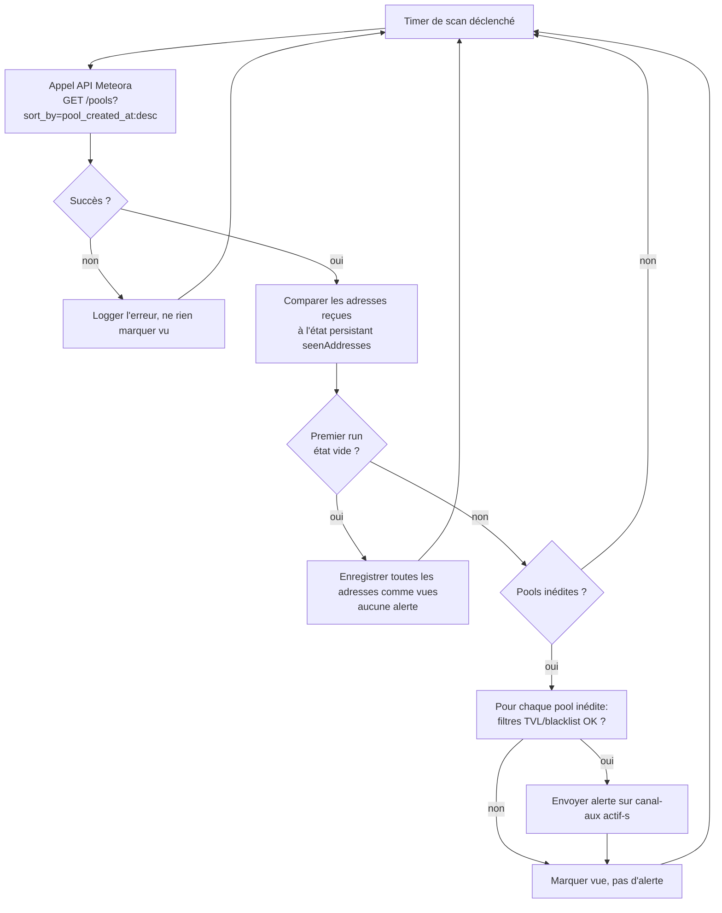

# Spécification fonctionnelle — Alertes « Nouvelle pool Meteora »

> Périmètre : nouveau système de **notification** (Discord et/ou Telegram) qui alerte dès
> qu'une **nouvelle pool Meteora DLMM** est créée sur Solana.
>
> Statut : spécification produit (aucune implémentation). Version 1 — 2026-07-17.

---

## 1. Contexte & problème

### Le besoin
`PoolsPage.tsx` (route `/pools`) interroge déjà l'API Meteora DLMM
(`https://dlmm.datapi.meteora.ag/pools?...&sort_by=pool_created_at:desc`) toutes les 15 s et
détecte côté client les pools nouvellement apparues (badge `NEW`, surlignage de ligne). C'est
**passif** : il faut garder l'onglet ouvert et regarder le tableau.

Le propriétaire (Enzo) veut être **notifié activement** (Discord et/ou Telegram) dès qu'une
nouvelle pool DLMM est créée, sans avoir à garder la page ouverte.

### Pourquoi maintenant
La détection existe déjà et fonctionne (`seenAddresses` dans `PoolsPage.tsx`) — c'est une
diffusion, pas une nouvelle logique de détection. Il manque uniquement un composant qui tourne en
continu côté serveur (la SPA ne tourne que quand l'onglet est ouvert) et qui pousse l'info vers un
canal de notification.

### Contrainte structurante
Un bot Discord ou Telegram exige un **secret côté serveur** (webhook URL / bot token). L'app
actuelle est 100 % cliente (toute clé `VITE_` est publique, embarquée dans le bundle). **Ce projet
introduit donc un composant serveur/serverless**, comme documenté pour le projet
`docs/specs/telegram-alerts/` (alertes Supertrend) — voir la spécification technique pour la
question de mutualisation ou non de l'infrastructure entre les deux projets.

---

## 2. Objectifs & résultats attendus

| # | Objectif | Résultat mesurable |
|---|----------|--------------------|
| O1 | Détecter automatiquement toute nouvelle pool DLMM | 100 % des pools créées apparaissent dans un cycle de scan, sans intervention humaine |
| O2 | Notifier en quasi temps réel | Alerte reçue **≤ 2 min** après la création on-chain de la pool |
| O3 | Éviter le spam | **0** alerte dupliquée pour une même pool (adresse), y compris après redémarrage du service |
| O4 | Fiabilité | Une panne de l'API Meteora ou du canal de notification ne stoppe pas le service (le cycle suivant reprend normalement) |
| O5 | Message actionnable | Chaque alerte permet de décider en < 10 s de regarder ou non la pool (nom, adresse, bin step, frais, TVL, lien Meteora) |
| O6 | Coût maîtrisé | Fonctionnement dans une enveloppe gratuite ou quasi gratuite |
| O7 | Multi-canal | Le propriétaire peut activer Discord, Telegram, ou les deux simultanément, sans changer de code |

---

## 3. Personas / utilisateurs cibles

- **Enzo (scout de pools, utilisateur unique du MVP)** : veut être alerté sur Discord et/ou
  Telegram dès qu'une pool DLMM apparaît, pour évaluer rapidement si elle vaut la peine d'y
  apporter de la liquidité ou d'y trader tôt.
- **(Éventuel, post-MVP)** un canal Discord de serveur ou un groupe Telegram partagé avec
  plusieurs abonnés. Hors périmètre MVP.

---

## 4. Glossaire

- **Pool DLMM** : pool de liquidité "Dynamic Liquidity Market Maker" Meteora sur Solana,
  identifiée par son adresse (`address`).
- **`pool_created_at`** : paramètre de tri de l'API Meteora ; correspond au champ `created_at`
  (timestamp Unix ms) dans la réponse — voir `PoolsPage.tsx`.
- **Bin step** : granularité des prix dans une pool DLMM (paramètre `pool_config.bin_step`).
- **Pool vue / inédite** : une pool est « inédite » si son `address` n'a encore jamais été
  rencontrée par le service (peu importe son âge réel on-chain, seul l'historique du service
  compte — cf. cas limite premier run, §9).

---

## 5. Périmètre

### Inclus (MVP)
- Un pipeline serveur/serverless qui, en continu :
  - récupère les pools DLMM les plus récentes via l'API Meteora déjà utilisée par la SPA ;
  - compare aux pools déjà vues (état persistant) pour isoler les pools **inédites** ;
  - envoie une **alerte** (Discord et/ou Telegram selon configuration) pour chaque pool inédite.
- Un message d'alerte formaté, adapté à chaque canal (embed Discord / message Telegram).
- Une **configuration centralisée** : canal(aux) actif(s), secrets, intervalle de scan, filtres
  optionnels (cf. RG-03).
- Gestion des erreurs/indisponibilités de l'API Meteora et des canaux sans arrêt du service.

### Exclu / repoussé (Won't, cette version)
- Interface web de configuration (les paramètres sont en config/env au MVP).
- Multi-utilisateurs, comptes, abonnements.
- Autres canaux que Discord/Telegram (e-mail, webhook générique, SMS) — non exclu par
  l'architecture (notifier abstrait), mais non implémenté au MVP.
- Analyse ou scoring de la pool (sécurité du contrat, rug-check, etc.) — l'alerte relaie les
  données brutes de l'API Meteora, elle ne les juge pas.
- Passage d'ordres / apport de liquidité automatique. **Le système alerte, il n'agit jamais.**
- Historique consultable des alertes au-delà de l'état minimal nécessaire à la dédup.
- Fusion avec le projet `telegram-alerts` (Supertrend) : les deux specs restent indépendantes
  fonctionnellement, même si elles peuvent partager de l'infrastructure (cf. spec technique).

---

## 6. User stories & critères d'acceptation

> Traçabilité : chaque US référence l'objectif qu'elle sert (O1-O7).

### US-01 — Recevoir une alerte à la création d'une pool *(O1, O2, O5)*
**En tant que** scout de pools, **je veux** recevoir une notification dès qu'une nouvelle pool
DLMM apparaît, **afin de** pouvoir l'évaluer et agir tôt.

Critères d'acceptation :
- **Given** une pool dont l'`address` n'a jamais été vue par le service, **when** un cycle de scan
  la récupère, **then** une alerte est envoyée sur le(s) canal(aux) actif(s) **≤ 2 min** après sa
  détection par l'API Meteora.
- **Given** une pool déjà connue du service, **when** elle réapparaît dans un scan suivant,
  **then** aucune nouvelle alerte n'est envoyée.
- L'alerte contient au minimum : nom de la pool, adresse, bin step, frais de base, TVL, âge, et un
  lien vers `https://app.meteora.ag/dlmm/{address}`. *(cf. §8)*

### US-02 — Ne pas être spammé au démarrage *(O3)*
**En tant que** scout de pools, **je veux** qu'au tout premier démarrage du service, les pools déjà
existantes ne déclenchent pas 50 alertes d'un coup, **afin de** ne recevoir que des alertes sur de
vraies nouveautés.

Critères d'acceptation :
- **Given** un état persistant vide (premier run), **when** le premier cycle s'exécute, **then**
  toutes les pools récupérées sont enregistrées comme « déjà vues » **sans** déclencher d'alerte.
- **Given** un redémarrage du service avec un état persistant existant, **when** le service
  reprend, **then** aucune pool déjà connue n'est re-notifiée.

### US-03 — Choisir le(s) canal(aux) de notification *(O7)*
**En tant que** propriétaire, **je veux** activer Discord, Telegram, ou les deux, via
configuration, **afin de** recevoir les alertes là où je les consulte réellement.

Critères d'acceptation :
- **Given** la configuration `ALERT_CHANNELS=discord`, **when** une alerte est déclenchée,
  **then** elle part uniquement sur Discord.
- **Given** `ALERT_CHANNELS=telegram,discord`, **when** une alerte est déclenchée, **then** elle
  part sur les deux canaux, de façon indépendante (l'échec d'un canal n'empêche pas l'envoi sur
  l'autre — cf. US-05).
- Aucun canal configuré → le service démarre quand même mais logge un avertissement (rien à
  notifier n'est pas une erreur bloquante).

### US-04 — Filtrer les pools trop peu intéressantes *(Should, O5)*
**En tant que** scout de pools, **je veux** pouvoir ignorer les pools sous un seuil de TVL ou
taguées comme suspectes, **afin de** ne pas être alerté sur du bruit.

Critères d'acceptation :
- **Given** un seuil `MIN_TVL_ALERT` configuré, **when** une pool inédite a une TVL inférieure,
  **then** elle est enregistrée comme vue mais **aucune alerte** n'est envoyée.
- **Given** une pool avec `is_blacklisted: true` dans la réponse API, **when** elle est détectée,
  **then** elle est enregistrée comme vue mais **aucune alerte** n'est envoyée (comportement par
  défaut, désactivable — cf. RG-04).
- Par défaut (MVP), `MIN_TVL_ALERT = 0` (aucun filtre TVL) : on aligne le comportement par défaut
  sur `PoolsPage.tsx`, qui n'exclut aucune pool. Le filtre est une option, pas une contrainte du
  MVP.

### US-05 — Le service survit aux pannes *(O4)*
**En tant que** propriétaire, **je veux** que le pipeline continue de tourner malgré une panne de
l'API Meteora ou d'un canal de notification, **afin de** ne pas rater les alertes des cycles
suivants.

Critères d'acceptation :
- **Given** un cycle où l'API Meteora renvoie une erreur (429/5xx/timeout), **when** l'erreur
  survient, **then** elle est loggée (réutiliser `apiError.ts`), aucune pool n'est marquée comme
  vue pour ce cycle, et le cycle suivant retente normalement.
- **Given** un canal (Discord ou Telegram) indisponible lors de l'envoi, **when** l'échec survient,
  **then** il est loggé, une politique de retry (RG-08) s'applique, et **l'autre canal actif**
  (si configuré) reçoit tout de même son alerte.
- **Given** l'envoi qui échoue définitivement après retries sur tous les canaux, **when** cela se
  produit, **then** la pool reste marquée comme « vue » (pas de re-tentative infinie sur une pool
  périmée) et l'échec est loggé comme critique.

### US-06 — Message groupé si rafale *(Could, O3, O5)*
**En tant que** scout de pools, **je veux** que si plusieurs pools sont créées dans le même cycle,
je ne reçoive pas une alerte par pool sans limite, **afin de** rester lisible.

Critères d'acceptation :
- **Given** N pools inédites détectées dans un même cycle, **when** N dépasse un seuil (ex. 5),
  **then** les alertes sont soit throttlées (espacées), soit agrégées en un seul message
  récapitulatif (choix à trancher, cf. §11 Q2).

---

## 7. Parcours utilisateur (vue macro)



---

## 8. Format du message d'alerte

Scannable en < 10 s. Champs communs aux deux canaux, adaptation de forme par canal.

**Telegram** (Markdown/HTML) :
```
🆕 NOUVELLE POOL METEORA · SOL/XYZ

Bin step : 100
Frais    : 1.5%
TVL      : 12 400 $
Créée il y a : 2min

Adresse : 7xKX...9pQ2  (tap pour copier)
🔗 Voir sur Meteora
```

**Discord** (embed) : mêmes champs, en `embed.fields` (titre = nom de la pool, couleur d'accent,
lien cliquable en `embed.url`, timestamp ISO en `embed.timestamp`).

Règles de contenu :
- Titre = nom de la pool (`name`), immédiatement identifiable.
- Montants formatés lisiblement (abréviations k/M si pertinent).
- Adresse tronquée affichée, entière copiable ; lien Meteora cliquable
  (`https://app.meteora.ag/dlmm/{address}`).
- Âge affiché avec la même logique que `formatAge()` de `PoolsPage.tsx` (secondes/minutes/heures/
  jours), calculé sur `created_at`.
- Aucune donnée sensible (pas de secret, pas de token de config) dans le message.

---

## 9. Règles de gestion

> Valeurs par défaut = **hypothèses** à valider (cf. §11). Configurables sauf mention contraire.

| ID | Règle | Valeur par défaut proposée | Configurable |
|----|-------|----------------------------|--------------|
| RG-01 | Intervalle de scan | `1 min` | oui |
| RG-02 | Nombre de pools récupérées par cycle | `50` (`page_size=50`, comme `PoolsPage.tsx`) | oui |
| RG-03 | TVL minimum pour déclencher une alerte | `0 $` (aucun filtre au MVP) | oui |
| RG-04 | Exclure les pools `is_blacklisted: true` | activé | oui |
| RG-05 | Canal(aux) de notification actif(s) | à définir par `ALERT_CHANNELS` (`discord`, `telegram`, ou les deux) | oui |
| RG-06 | Premier run = amorçage silencieux (pas d'alerte) | activé | non |
| RG-07 | Une pool ne déclenche jamais deux alertes (idempotence par `address`) | activé | non |
| RG-08 | Retry d'envoi en cas d'échec canal | 3 tentatives, backoff exponentiel (2s/8s/30s) | oui |
| RG-09 | Taille max de l'état persistant (adresses vues conservées) | `5 000` adresses (éviction FIFO des plus anciennes) | oui |

### Cas limites explicites
- **Premier run / état vide** : toutes les pools du premier scan sont enregistrées **sans**
  alerte (RG-06) — même logique que le « run d'amorçage » décrit dans le projet Supertrend.
- **Pagination/chevauchement** : si l'API renvoie deux fois la même pool sur des cycles proches,
  l'idempotence par `address` (RG-07) empêche toute double alerte.
- **API Meteora indisponible un cycle** : aucune pool marquée vue pour ce cycle (pour ne pas
  « rater » silencieusement une création survenue pendant la panne) ; le cycle suivant la
  détectera normalement dès que l'API répond de nouveau.
- **Pool avec champs manquants/nuls** (ex. `tvl` absent) : alerte envoyée quand même avec un
  affichage `N/A` pour le champ manquant plutôt que de bloquer l'alerte (contrairement au
  Supertrend, ici il n'y a pas de calcul qui dépend de la donnée manquante).
- **Un seul canal configuré tombe en panne, l'autre fonctionne** : l'alerte part quand même sur
  le canal disponible (US-05).

---

## 10. Exigences non fonctionnelles

- **Latence** : alerte ≤ 2 min après détection par l'API Meteora (O2).
- **Disponibilité** : pipeline en continu, objectif ≥ 99 % de cycles exécutés sur 24 h glissantes.
- **Sécurité** : le token du bot Telegram et/ou l'URL du webhook Discord sont des **secrets
  serveur**, jamais exposés dans le bundle client ni commités. Même rupture de modèle que
  documentée dans `telegram-alerts/SPECIFICATION-TECHNIQUE.md` §9.
- **Résilience aux rate-limits** : un seul appel API Meteora par cycle (charge très faible
  comparée au projet Supertrend qui interroge l'OHLCV par token).
- **Coût** : enveloppe gratuite/quasi gratuite (O6).
- **Observabilité** : logs structurés par cycle (nb pools récupérées, nb inédites, nb alertes
  envoyées par canal, erreurs). Réutiliser la sémantique de `apiError.ts`.
- **i18n** : messages en **français**, cohérent avec l'UI existante.
- **Idempotence** : une pool ne doit jamais produire deux alertes, y compris après un redémarrage
  du service entre détection et envoi (état de dédup persistant).

---

## 11. Hypothèses & questions ouvertes

> Contrairement au projet `telegram-alerts/`, aucune décision n'a encore été validée par Enzo pour
> celui-ci — les valeurs ci-dessous sont des **propositions** à confirmer avant le Lot 0 du plan de
> mise en œuvre.

- **Q1 (hébergement)** : réutiliser le même Cloudflare Worker + KV que le projet Supertrend
  (mutualisation) ou déployer un Worker séparé, plus simple, dédié à cette seule alerte ? Voir
  spec technique §3 pour l'analyse des deux options.
- **Q2 (anti-rafale, US-06)** : en cas de création massive de pools dans un même cycle (rare mais
  possible), throttling ou message agrégé ? Proposition par défaut : pas de traitement spécial au
  MVP (accepter jusqu'à N messages), à revisiter si le volume réel le justifie.
- **Q3 (filtre TVL/blacklist, US-04)** : le seuil `MIN_TVL_ALERT = 0$` par défaut aligne le
  comportement sur `PoolsPage.tsx` (aucun filtre). À confirmer si Enzo veut un plancher dès le
  MVP pour réduire le bruit des pools à TVL quasi nulle créées en test.
- **Q4 (canal par défaut)** : au tout premier déploiement, quel canal activer en premier —
  Discord, Telegram, ou les deux d'emblée ? Impacte l'ordre des tâches P3/P4 du plan de mise en
  œuvre.
- **Q5 (fréquence de scan, RG-01)** : `1 min` est une proposition tenant compte de la latence
  cible O2 (≤ 2 min) et de la légèreté de l'appel API (un seul endpoint, `page_size=50`). À
  confirmer selon le rate-limit réel observé de l'API Meteora (non documenté publiquement).
