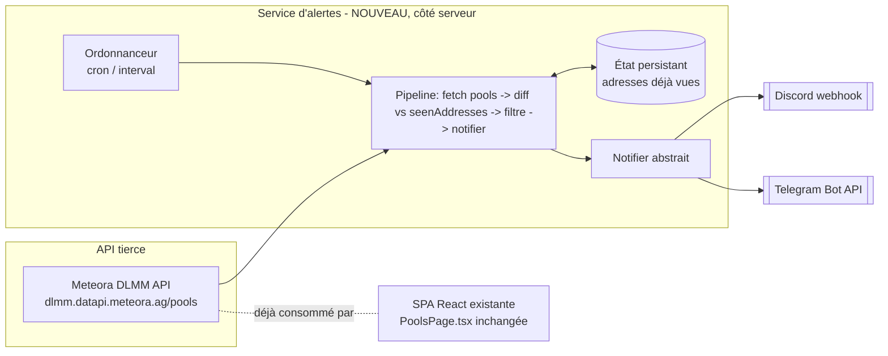

# Spécification technique — Alertes « Nouvelle pool Meteora »

> Complément technique de `SPECIFICATION-FONCTIONNELLE.md`. Aucune implémentation ici : décisions
> d'architecture, contrats de données, gestion des secrets et des erreurs.
> Version 1 — 2026-07-17.

---

## 1. Point de départ : ce que l'archi actuelle NE permet pas

`src/pages/PoolsPage.tsx` fait déjà 90 % du travail de **détection** :
- il appelle `GET https://dlmm.datapi.meteora.ag/pools?page=1&page_size=50&sort_by=pool_created_at:desc` ;
- il compare les `address` reçues à un `Set` en mémoire (`seenAddresses`, un `useRef`) pour
  déterminer quelles pools sont « nouvelles depuis le dernier fetch » ;
- il ne notifie nulle part : le seul effet visible est un badge `NEW` dans le tableau.

Deux limites structurelles empêchent de transformer ça en alerte poussée sans nouveau composant :
1. **La SPA ne tourne que si l'onglet est ouvert.** `seenAddresses` vit en mémoire du navigateur ;
   fermer l'onglet remet tout à zéro et arrête toute détection.
2. **Un bot Discord/Telegram exige un secret côté serveur** (webhook URL Discord ou token de bot
   Telegram) — inutilisable en `VITE_*` (embarqué publiquement dans le bundle client).

→ **On introduit un composant serveur/serverless dédié**, découplé de la SPA, qui **réutilise la
même API et le même principe de diff** que `PoolsPage.tsx`, mais avec un état persistant côté
serveur au lieu d'un `useRef` client. La SPA reste inchangée.

---

## 2. Vue d'ensemble de l'architecture



Le service est **additif** : aucun fichier `src/` existant n'est modifié.

---

## 3. Hébergement

> Question ouverte Q1 (spec fonctionnelle §11) : mutualiser avec le projet `telegram-alerts/`
> (Supertrend) ou déployer séparément ? Les deux options sont documentées ci-dessous ; la
> recommandation est **option 1** si le projet Supertrend est déployé, sinon **option 2**.

| Option | Description | Avantage | Inconvénient |
|--------|-------------|----------|---------------|
| **1. Mutualiser** avec le Worker Cloudflare du projet Supertrend (`telegram-alerts/`) | Un second Cron Trigger sur le même Worker, une nouvelle clé KV dédiée (`seenPools:*`) | Pas de nouvelle enveloppe à provisionner, un seul lieu de secrets | Couple le cycle de vie des deux fonctionnalités (un déploiement du Worker touche les deux) |
| **2. Worker séparé** (recommandé si Supertrend n'est pas encore déployé, ou si on veut un découplage total) | Cloudflare Worker + Cron Trigger + KV dédiés à cette seule alerte | Isolation complète, plus simple à raisonner seul | Une enveloppe gratuite de plus à gérer (reste dans le free tier) |

Dans les deux cas : **Cloudflare Worker + Cron Trigger + KV**, gratuit, cohérent avec la
contrainte « pas de serveur payant persistant » déjà actée pour le projet Supertrend (voir
`telegram-alerts/SPECIFICATION-TECHNIQUE.md` §3). Alternative de repli : cron GitHub Actions +
état dans un Gist ou Upstash Redis, si Cloudflare s'avère inadapté — granularité minimale ~5 min,
suffisante ici (RG-01 = 1 min est un objectif, pas un plancher dur : la latence cible O2 est 2 min).

---

## 4. Source de données — API Meteora DLMM

Réutilisation directe de l'appel existant :

```
GET https://dlmm.datapi.meteora.ag/pools?page=1&page_size=50&sort_by=pool_created_at:desc
Accept: application/json
```

Aucune clé API requise (cohérent avec `PoolsPage.tsx`). Les types de réponse peuvent être
**copiés tels quels** depuis `src/pages/PoolsPage.tsx` (`MeteoraPool`, `PoolsResponse`,
`TokenMetrics`, `TimeWindowData`, `PoolConfig`) — aucune divergence de contrat attendue puisque
c'est le même endpoint.

Champs utiles à l'alerte : `address`, `name`, `created_at` (unix ms), `tvl`, `pool_config.bin_step`,
`pool_config.base_fee_pct`, `is_blacklisted`.

> **Rate limit non documenté publiquement.** Un seul appel par cycle (contrairement au projet
> Supertrend qui fait un appel OHLCV par token candidat) → charge négligeable. Pas de stratégie de
> throttling nécessaire au MVP ; prévoir un backoff simple en cas de 429/5xx (RG-08 côté fonctionnel).

---

## 5. Composants / modules à créer

| Module | Responsabilité |
|--------|----------------|
| `scheduler` | Déclenche un cycle à intervalle régulier (Cron Trigger) |
| `config` | Charge et valide la configuration (canaux actifs, secrets, seuils, intervalle) ; refuse de démarrer si incohérente |
| `poolFetcher` | Appelle l'API Meteora, réutilise les types de `PoolsPage.tsx` |
| `diffDetector` | Compare les adresses reçues à l'état persistant → produit la liste des pools inédites |
| `stateStore` | Lit/écrit l'état persistant (adresses vues, avec éviction FIFO au-delà de RG-09) |
| `notifier` | Interface abstraite `send(alert): Promise<void>` ; implémentations `discordNotifier` et `telegramNotifier` |
| `apiFailure` | Réutiliser `src/lib/apiError.ts` (déjà framework-agnostique) pour qualifier les échecs Meteora |
| `logger` | Logs structurés par cycle |

### Interface `notifier`
```ts
interface PoolAlert {
  address: string;
  name: string;
  createdAtMs: number;
  tvl: number;
  binStep: number;
  baseFeePct: number;
}

interface Notifier {
  send(alert: PoolAlert): Promise<void>;
}
```
`discordNotifier` et `telegramNotifier` implémentent chacun cette interface ; le pipeline appelle
tous les notifiers actifs (`ALERT_CHANNELS`) via `Promise.allSettled` pour qu'un canal en panne
n'empêche pas l'envoi sur l'autre (US-05).

---

## 6. Modèle de données (état persistant)

### Entité `SeenPools` (KV)
Une seule clé KV (ex. `seenPools`) contenant un tableau JSON borné :

```jsonc
{
  "addresses": ["7xKX...9pQ2", "..."],  // FIFO, borné à RG-09 (5000)
  "updatedAt": 1752670800
}
```

Alternative si le volume justifie une clé par pool (`seenPools:{address}` → `{ firstSeenAt }`) :
plus simple à faire évoluer (TTL KV natif possible), mais plus d'opérations KV par cycle. Au
volume attendu (quelques dizaines de nouvelles pools/jour), **une seule clé agrégée** suffit et
minimise les lectures/écritures KV (le free tier Cloudflare KV a un quota d'opérations/jour).

> **Idempotence** : une `address` déjà présente dans `SeenPools.addresses` n'est jamais
> re-notifiée, même après redémarrage (RG-07).

---

## 7. Contrats d'interface

### 7.1 Entrée : API Meteora
Cf. §4. Toute réponse en échec passe par `readApiFailure`/`formatApiFailure` (`apiError.ts`).

### 7.2 Sortie : Discord Webhook
- `POST <DISCORD_WEBHOOK_URL>`
- Body :
  ```jsonc
  {
    "embeds": [{
      "title": "🆕 SOL/XYZ",
      "url": "https://app.meteora.ag/dlmm/7xKX...9pQ2",
      "color": 3066993,
      "fields": [
        { "name": "Bin step", "value": "100", "inline": true },
        { "name": "Frais", "value": "1.5%", "inline": true },
        { "name": "TVL", "value": "12 400 $", "inline": true }
      ],
      "timestamp": "2026-07-17T14:32:00.000Z"
    }]
  }
  ```
- Le webhook Discord est **le mécanisme le plus simple** : pas de bot à héberger, pas de
  commandes entrantes, une seule URL secrète à protéger. Suffisant pour ce cas d'usage
  (notification sortante uniquement, cf. §9).
- Codes de retour à gérer : `204` OK ; `429` (respecter `retry_after` du body) ; `401/404`
  (webhook invalide/supprimé → log critique).
- Limite Discord : 30 requêtes/min par webhook — largement suffisant ici (1 pool ≈ 1 requête,
  volume attendu très inférieur).

### 7.3 Sortie : Telegram Bot API
- `POST https://api.telegram.org/bot<TOKEN>/sendMessage`
- Body : `{ chat_id, text, parse_mode: "HTML", disable_web_page_preview: true }`
- Mêmes codes de retour et limites que documentés dans
  `telegram-alerts/SPECIFICATION-TECHNIQUE.md` §7.1 (~30 msg/s global, ~1 msg/s par chat).

---

## 8. Sécurité & gestion des secrets

- **Secrets serveur uniquement**, jamais `VITE_`-préfixés, jamais commités :
  - `DISCORD_WEBHOOK_URL` (si Discord actif)
  - `TELEGRAM_BOT_TOKEN` + `TELEGRAM_CHAT_ID` (si Telegram actif)
- Stockage : secrets de la plateforme (Cloudflare Worker Secrets, ou GitHub Actions Secrets selon
  l'option d'hébergement retenue). Ajouter un `.env.example` documentant les noms sans valeurs.
- **Surface d'attaque** : le service n'expose aucun endpoint entrant (il appelle Discord/Telegram/
  Meteora, il n'écoute pas). Pas de webhook Telegram entrant, pas de commandes Discord — donc pas
  de surface HTTP à sécuriser au MVP.
- Le webhook Discord est un secret au même titre qu'un token : quiconque le possède peut poster
  dans le canal cible → à traiter avec la même rigueur qu'un token Telegram.

---

## 9. Impacts sur l'existant, mutualisation, risques

- **Impact SPA** : nul (additif). `apiError.ts` et les types `MeteoraPool`/`PoolsResponse` sont
  **partagés en lecture** (copiés ou importés selon la structure du repo serveur choisie) —
  attention à ne pas dupliquer silencieusement si l'API Meteora fait évoluer son contrat : un seul
  endroit devrait définir ces types si le service vit dans le même repo/mono-repo.
- **Mutualisation avec `telegram-alerts/`** : les deux projets peuvent partager le même Worker
  Cloudflare (Q1) ; dans ce cas, `stateStore` doit utiliser des clés KV **distinctes**
  (`seenPools` vs `TokenTrendState`/`AlertRecord`) pour éviter toute collision.
- **Risque R1 (API Meteora sans SLA documenté)** : pas de garantie de rate-limit ou de disponibilité
  publiée. Mitigation : un seul appel/cycle, backoff sur erreur, ne jamais bloquer sur un échec
  (US-05).
- **Risque R2 (webhook/token révoqué sans notification)** : si Discord/Telegram invalide le
  secret, les alertes échouent silencieusement côté utilisateur si les logs ne sont pas surveillés.
  Mitigation : logger les échecs `401/403/404` comme critiques (§7.2/§7.3), envisager une alerte
  de repli (ex. e-mail) en cas d'échec total — hors MVP, à noter comme dette.
- **Risque R3 (croissance de l'état KV)** : bornée par RG-09 (5 000 adresses, éviction FIFO) —
  largement suffisant vu le volume de créations de pools DLMM observé.

---

## 10. Tests

| Niveau | Cible | Exemples |
|--------|-------|----------|
| Unitaire | `diffDetector` | État vide → aucune pool signalée comme inédite (amorçage) ; état partiel → seules les adresses absentes sont inédites ; adresse déjà vue → jamais re-signalée |
| Unitaire | `config` validation | Aucun canal actif → démarrage avec avertissement, pas de crash ; secrets manquants pour un canal actif → refus de démarrer |
| Unitaire | `apiError` (déjà pur) | Mapping status/body → cause |
| Intégration | `poolFetcher` | Réponse Meteora mockée → pools normalisées, mêmes types que `PoolsPage.tsx` |
| Intégration | `stateStore` | Éviction FIFO au-delà de RG-09 ; persistance entre deux appels simulés |
| Intégration | `notifier` | Un canal qui échoue (mock 500) n'empêche pas l'envoi sur l'autre canal actif (`Promise.allSettled`) |
| E2E (léger, manuel au MVP) | pipeline complet | Pool mockée inédite → message reçu sur un canal Discord/Telegram de test |
