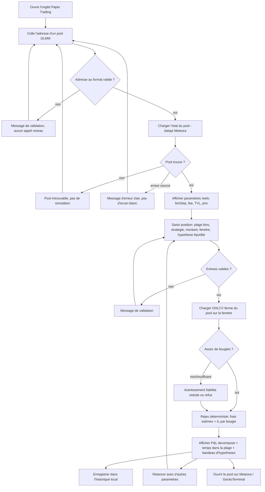

# Spécification fonctionnelle — Paper trading DLMM (simulation de P&L d'une position de liquidité)

> Périmètre : nouvelle **page/onglet** dans la SPA où l'utilisateur simule le **P&L d'une position
> de liquidité Meteora DLMM** — frais collectés vs impermanent loss — en **rejouant l'historique
> récent** d'un pool réel, **sans dépenser de fonds ni signer la moindre transaction on-chain**.
>
> Statut : **spécifié, non implémenté**. Version 1 — 2026-07-22.
> Cible d'implémentation : `src/pages/PaperTradingPage.tsx`, route `/paper-trading`.
>
> Note de cadrage : comme le reste du projet, la page est **100 % cliente, gratuite, sans clé API
> ni secret serveur**. Cette contrainte structure fortement le périmètre : le P&L d'une position
> DLMM dépend de données (distribution de liquidité réelle par bin, volume par bin) qui **ne sont
> pas exposées gratuitement**. On calcule donc une **estimation à partir d'un modèle simplifié
> explicite** (cf. §4, §9, §11), jamais un chiffre présenté comme une vérité on-chain. Ce document
> reprend la rigueur de `docs/specs/token-scanner/` : les hypothèses non confirmées sont marquées
> comme telles, les incertitudes documentées plutôt qu'inventées.

---

## 1. Contexte & problème

### Le besoin
Le projet sait déjà **découvrir** des pools Meteora DLMM (`/pools`, polling des nouvelles pools) et
**inspecter le risque** d'un token (`/scanner`). Il manque l'étape que fait un LP avant d'engager du
capital : **« si j'avais mis X $ de liquidité sur ce pool, avec cette plage de bins et cette
stratégie de distribution, qu'est-ce que ça aurait donné sur les dernières 24 h / 7 j ? »**

Fournir de la liquidité sur un DLMM n'est pas neutre : selon le `binStep`, la largeur de la plage
(`range`) et la stratégie (`Spot` / `Curve` / `BidAsk`), on peut soit capturer beaucoup de frais,
soit subir un **impermanent loss** qui dépasse les frais dès que le prix sort de la plage. Aujourd'hui,
pour se faire une idée, Enzo doit soit engager du vrai capital (0,25 SOL de création + le capital
lui-même) et signer des transactions, soit deviner à la main. Aucun outil clé en main de
**backtesting historique** DLMM gratuit n'a été trouvé (cf. `docs/research/meteora-hawkfi-lparmy.md`
§4 : le « DLMM Playground » de LP Army semble opérer sur pools réels en temps réel, pas en rejeu).

### Ce que la page apporte
Un **simulateur de paper trading** : on choisit un pool DLMM réel, on paramètre une position
virtuelle (plage de bins, stratégie, montant virtuel, fenêtre historique), on lance, et on obtient
un **P&L estimé décomposé** — frais estimés collectés, impermanent loss vs hold, résultat net,
fraction du temps passé dans la plage — le tout calculé **côté client** à partir de données en
lecture seule déjà utilisées ailleurs dans le repo. Aucune transaction, aucun wallet, aucun coût.

### Pourquoi maintenant
Toutes les briques de données sont déjà en place et confirmées côté client dans ce repo :
- l'**état d'un pool DLMM** (bin step, base fee, TVL, volume/fees par fenêtre) via la datapi Meteora
  (`dlmm.datapi.meteora.ag`), déjà appelée sans souci CORS par `src/pages/PoolsPage.tsx` ;
- l'**historique OHLCV** d'un pool via GeckoTerminal (`api.geckoterminal.com`), déjà normalisé par
  `indicator-alerter/ohlcvClient.ts`, et/ou la datapi Meteora elle-même (`/ohlcv/{address}`).

Le calcul de P&L d'une position DLMM est **déterministe** à partir de ces données. Le coût marginal
d'ajouter une page de simulation est donc faible ; la valeur (éviter d'engager du capital sur une
config perdante) est immédiate.

### Contrainte structurante
Le P&L exact d'une position DLMM dépend de deux grandeurs que **le modèle de données gratuit
n'expose pas** :
1. la **distribution de liquidité réelle du pool par bin** (donc la part de frais qui vous revient
   dans chaque bin) — disponible seulement on-chain via le SDK, pas en REST gratuit ;
2. le **volume swap réel par bin de prix** — l'OHLCV ne donne qu'un volume agrégé par bougie, pas
   sa répartition sur les prix traversés.

La page ne peut donc produire qu'une **estimation via un modèle simplifié**, dont toutes les
hypothèses sont **affichées à l'écran** (O4). C'est le pendant, pour ce besoin, du principe
« ne jamais tromper l'utilisateur » du scanner : ici on n'invente pas une donnée manquante, on
**assume et affiche un modèle**.

---

## 2. Objectifs & résultats attendus

| # | Objectif | Résultat mesurable |
|---|----------|--------------------|
| O1 | Estimer le P&L d'une position DLMM sans capital ni transaction | Un P&L net estimé (frais − IL) affiché après lancement, **0 transaction on-chain, 0 wallet** |
| O2 | Comparer rapidement plusieurs configurations sur un même pool | Relancer avec une autre plage/stratégie/montant met à jour le résultat sans rechargement de page |
| O3 | Rester gratuit et 100 % client | **0 €** d'API, aucune clé, aucun secret, aucun backend (comme le reste du projet) |
| O4 | Ne jamais présenter l'estimation comme une vérité | Les **hypothèses du modèle** et son **niveau de fiabilité** sont affichés en permanence à côté du résultat ; aucune donnée manquante n'est devinée |
| O5 | Résilience par source de données | L'échec d'une source (OHLCV ou état du pool) affiche un message clair sans écran blanc |
| O6 | S'appuyer sur des données réelles, pas simulées | Le rejeu utilise l'**OHLCV historique réel** du pool et ses **paramètres réels** (bin step, fee) ; aucune trajectoire de prix inventée |

---

## 3. Personas / utilisateurs cibles

- **Enzo (LP / trader solo Solana, utilisateur unique du MVP)** : connaît les mécaniques DLMM
  (bins, plage, `Spot`/`BidAsk`/`Curve`, IL). Veut **tester une config avant d'engager du capital
  réel** et comparer « range serré vs large », « Spot vs Curve », sur un pool qu'il a repéré. Il
  sait qu'une simulation est une estimation ; il veut surtout un **ordre de grandeur honnête** et la
  possibilité de comparer des scénarios entre eux.
- **(Post-MVP, éventuel)** un LP moins expert qui aurait besoin de plus de pédagogie sur l'IL et les
  stratégies — la page fournit déjà un glossaire (§4) et des phrases de sens métier, mais
  l'accompagnement approfondi (tutoriel, aide contextuelle riche) est hors périmètre MVP.

---

## 4. Glossaire (sens métier pour un LP DLMM)

- **Pool DLMM** : pool Meteora à liquidité concentrée par **bins** (prix discrets). Identifié par
  son **adresse on-chain** (la même que sur `app.meteora.ag/dlmm/{address}` et dans `/pools`).
- **Bin** : un « seau » de prix discret. Le prix d'un bin est fixe ; la liquidité y est déposée à ce
  prix. Seul le **bin actif** (celui qui contient le prix courant) génère des frais à un instant
  donné.
- **`binStep`** : pas de prix entre deux bins consécutifs, en **basis points** (1 bp = 0,01 %).
  Prix du bin `i+1` = prix du bin `i` × `(1 + binStep/10000)`. Ex. `binStep = 25` → +0,25 % par bin.
  Plus le `binStep` est petit, plus les bins sont serrés (granularité fine, plage étroite en % pour
  un même nombre de bins).
- **Plage / `range`** : l'intervalle de bins sur lequel l'utilisateur dépose sa liquidité (ex. bin
  actif ± 30 bins). Plage étroite = frais plus concentrés mais on **sort** vite de la plage ; plage
  large = moins de frais par bin mais on reste « dans le marché » plus longtemps.
- **Stratégie de distribution** (`StrategyType`, cf. SDK Meteora) — comment le capital est réparti
  sur les bins de la plage :
  - **`Spot`** : répartition **uniforme** sur tous les bins de la plage. Polyvalent.
  - **`Curve`** : capital **concentré au centre** de la plage (autour du prix courant). Maximise les
    frais tant que le prix bouge peu ; plus exposé si le prix s'éloigne.
  - **`BidAsk`** : capital concentré **aux extrémités** de la plage (forme en U). Capte les gros
    mouvements / la volatilité ; utile pour du DCA in/out directionnel.
- **Frais collectés (fees)** : part des frais de swap qui revient au LP, proportionnelle à la
  **liquidité qu'il détient dans le bin actif** au moment où le volume passe. C'est le **revenu** de
  la position.
- **Impermanent loss (IL)** : perte de valeur de la position par rapport à un **hold** simple des
  deux tokens, causée par la recomposition automatique du portefeuille quand le prix bouge. Sur un
  DLMM concentré, l'IL peut être **fort** : quand le prix sort de la plage, la position est
  entièrement convertie dans un seul des deux tokens.
- **Hold (référence)** : valeur qu'aurait eue le capital initial si on avait simplement **gardé** la
  répartition de départ des deux tokens, sans fournir de liquidité. C'est la référence contre
  laquelle on mesure l'IL et le P&L net.
- **P&L net (estimé)** : `frais collectés estimés − impermanent loss estimé`, en $ et en % du
  capital virtuel de départ. Positif = la position aurait battu le hold ; négatif = mieux valait
  hold.
- **Temps dans la plage (`time in range`)** : fraction de la fenêtre historique où le prix est resté
  **dans** la plage choisie (donc où la position gagnait effectivement des frais). Indicateur clé de
  qualité d'une plage.
- **Fenêtre historique** : la période rejouée (ex. dernières 24 h ou 7 j), matérialisée par une
  série de bougies OHLCV **fermées**.

---

## 5. Périmètre

### Inclus (MVP)
Simulation d'**une** position virtuelle sur **un pool DLMM réel existant**, à la demande :

| Élément | Détail | Source |
|---|---|---|
| Sélection d'un pool réel | L'utilisateur colle l'**adresse d'un pool DLMM** (ou la sélectionne depuis `/pools`, cf. Should) | datapi Meteora `GET /pools/{address}` |
| Chargement des paramètres réels du pool | `binStep`, base fee, TVL, `current_price`, volume/fees par fenêtre, tokens X/Y | datapi Meteora |
| Rejeu de l'historique de prix | OHLCV **fermé** du pool sur la fenêtre choisie | GeckoTerminal `ohlcv` et/ou datapi Meteora `GET /ohlcv/{address}` |
| Paramètres de position saisis | Plage (nb de bins autour du prix actif), stratégie (`Spot`/`Curve`/`BidAsk`), montant virtuel ($), fenêtre (24 h / 7 j) | saisie utilisateur |
| Hypothèse de liquidité concurrente | Choix explicite : **« LP solo » (borne haute)** ou **« part du pool » (estimation)** — cf. §9, RG-08 | saisie utilisateur |
| Résultat décomposé | Frais estimés, IL estimé, **P&L net** ($ et %), valeur position vs hold, **temps dans la plage**, nb de bougies rejouées | calcul client |
| Bandeau d'hypothèses | Les hypothèses du modèle et le **niveau de fiabilité** affichés en permanence (O4) | statique + dérivé |
| Historique / favoris | Sauvegarde locale des simulations passées (paramètres + résultat), relançables | `localStorage` |
| Liens externes | Ouvrir le pool sur `app.meteora.ag/dlmm/{address}` et sur GeckoTerminal | liens |

### Exclu / repoussé (Won't, cette version)
- **Toute transaction on-chain** : création de pool, ouverture/fermeture de position, apport de
  liquidité, swap. **La page simule, elle n'agit jamais.** Pas d'intégration signature du SDK
  `@meteora-ag/dlmm`.
- **Wallet connecté** : aucune connexion de portefeuille, aucune signature, aucune adresse
  utilisateur envoyée nulle part.
- **Pool hypothétique de toutes pièces** (l'utilisateur invente tous les paramètres **et** l'historique
  de prix) : hors MVP — on part **toujours d'un pool réel** avec un historique réel (O6). Un mode
  « pool hypothétique + trajectoire simulée » est envisagé post-MVP (§11, Q6).
- **Projection vers le futur** (Monte-Carlo, prévision de prix) : le MVP **rejoue le passé**, il ne
  prédit rien. Une projection probabiliste est hors scope (§11, Q7).
- **Frais dynamiques exacts par bougie** : le DLMM applique un fee dynamique qui varie avec la
  volatilité ; le MVP utilise un **taux de frais effectif estimé** (cf. §9, RG-05), pas la reconstruction
  bloc par bloc du fee dynamique. Précision fine = post-MVP.
- **Distribution de liquidité réelle du pool par bin** : non exposée gratuitement (on-chain
  uniquement) → approximée (§9, RG-08), jamais récupérée réellement.
- **Auto-rebalance / auto-compound / TP-SL** (fonctions type Hawkfi) : la position simulée est
  **statique** sur la fenêtre (pas de rebalancement). Simulation de rebalancement = post-MVP (§11, Q8).
- **Multi-position / multi-pool simultané, comparaison côte-à-côte automatisée** : le MVP simule
  **une** position à la fois (la comparaison se fait en relançant et en s'appuyant sur l'historique).
- **Support multi-chaînes** : **Solana / Meteora DLMM uniquement**.
- **Dynamic AMM / DAMM v2 / Dynamic Vaults** : hors scope, seul le **DLMM** est simulé.

---

## 6. User stories & critères d'acceptation

> Traçabilité : chaque US référence l'objectif qu'elle sert (O1-O6). RG = règle de gestion §9.

### US-01 — Charger un pool DLMM réel *(O1, O6)*
**En tant que** LP, **je veux** coller l'adresse d'un pool Meteora DLMM et charger ses paramètres
réels, **afin de** simuler dessus sans avoir à ressaisir bin step / fee à la main.

Critères d'acceptation :
- **Given** une adresse de pool valide, **when** je la charge, **then** la page affiche les
  **paramètres réels** du pool (paire X/Y, `binStep`, base fee, TVL, prix courant) issus de la
  datapi Meteora.
- **Given** une adresse au format plausible mais inconnue de Meteora, **when** je la charge, **then**
  la page affiche « pool introuvable » **sans** simuler ni inventer de paramètres (RG-02).
- **Given** une saisie vide ou manifestement non conforme (hors base58, mauvaise longueur), **when**
  je valide, **then** un message de validation s'affiche et **aucun appel réseau** n'est déclenché
  (RG-01).

### US-02 — Paramétrer une position virtuelle *(O1)*
**En tant que** LP, **je veux** définir une plage de bins, une stratégie, un montant virtuel et une
fenêtre historique, **afin de** décrire la position que je veux tester.

Critères d'acceptation :
- **Given** un pool chargé, **when** je saisis une plage (nb de bins de part et d'autre du bin
  actif), **then** la page affiche la **largeur de plage en %** correspondante (dérivée du `binStep`,
  RG-03) pour que je visualise l'amplitude.
- **Given** un montant virtuel ≤ 0 ou non numérique, **when** je lance, **then** un message de
  validation s'affiche et la simulation n'est pas lancée (RG-01).
- **Given** une stratégie choisie parmi `Spot`/`Curve`/`BidAsk`, **when** je lance, **then** la
  répartition de liquidité correspondante est appliquée aux bins de la plage (RG-04).

### US-03 — Obtenir un P&L décomposé *(O1)*
**En tant que** LP, **je veux** un résultat qui sépare clairement frais estimés, impermanent loss et
P&L net, **afin de** comprendre **d'où** vient le résultat et pas seulement le chiffre final.

Critères d'acceptation :
- **Given** une position paramétrée sur un pool chargé, **when** je lance la simulation, **then** la
  page affiche : **frais estimés** ($), **IL estimé** ($ et %), **P&L net** ($ et % du capital),
  **valeur de la position vs hold**, **temps dans la plage** (%), et le **nombre de bougies
  rejouées**.
- **Given** un résultat affiché, **when** un P&L net est négatif, **then** il est visuellement
  distingué (code couleur) d'un P&L positif, avec le rappel « négatif = le hold aurait fait mieux ».
- **Given** le prix est resté hors de la plage sur toute la fenêtre, **when** la simulation aboutit,
  **then** la page indique explicitement « position hors plage sur toute la période : 0 frais
  collectés » (RG-06) plutôt qu'un frais nul silencieux.

### US-04 — Comprendre et jauger la fiabilité de l'estimation *(O4)*
**En tant que** LP, **je veux** voir en permanence les **hypothèses** du modèle et son **niveau de
fiabilité**, **afin de** ne pas prendre l'estimation pour un chiffre on-chain exact.

Critères d'acceptation :
- **Given** un résultat affiché, **when** je le lis, **then** un **bandeau d'hypothèses** liste au
  minimum : le taux de frais utilisé et son origine, l'hypothèse de liquidité concurrente retenue
  (LP solo vs part du pool), le fait que la distribution de volume par bin est **approximée**, et le
  fait que la position est **statique** (pas de rebalance).
- **Given** deux hypothèses de liquidité concurrente possibles, **when** je change ce réglage,
  **then** le résultat est recalculé et le bandeau reflète l'hypothèse active (RG-08).
- **Given** une donnée d'entrée dégradée (peu de bougies disponibles, taux de frais non déductible),
  **when** la simulation aboutit, **then** un **avertissement de fiabilité réduite** est affiché
  (RG-07) — l'estimation reste montrée, mais signalée comme moins fiable.

### US-05 — Comparer des configurations *(O2)*
**En tant que** LP, **je veux** relancer facilement avec d'autres paramètres, **afin de** comparer
« range serré vs large » ou « Spot vs Curve » sur le même pool.

Critères d'acceptation :
- **Given** une simulation affichée, **when** je modifie un paramètre et relance, **then** le
  résultat est recalculé **sans rechargement de page**, et les blocs se réinitialisent proprement
  (aucun résidu de la simulation précédente, RG-09).
- **Given** un pool déjà chargé, **when** je ne change que les paramètres de position (pas le pool),
  **then** la page **n'a pas besoin de recharger** l'OHLCV si la fenêtre est inchangée (réutilisation
  des bougies déjà en mémoire — cf. spec technique §7).

### US-06 — Historique & favoris de simulations *(O2)*
**En tant que** LP, **je veux** retrouver mes simulations passées et marquer les intéressantes en
favori, **afin de** ne pas reperdre une config testée.

Critères d'acceptation :
- **Given** une simulation lancée, **when** elle aboutit, **then** ses paramètres et son résultat
  synthétique sont enregistrés dans un **historique local** (`localStorage`) daté.
- **Given** une entrée d'historique, **when** je la rouvre, **then** ses paramètres re-remplissent le
  formulaire pour relancer (le résultat stocké est un instantané, la relance recalcule sur les
  données du moment — cf. RG-10).
- **Given** l'historique plein, **when** une nouvelle entrée non-favorite arrive, **then** la plus
  ancienne **non-favorite** est évincée ; une entrée **favorite n'est jamais évincée** (mirroir du
  scanner).
- **Given** `localStorage` indisponible (navigation privée) ou corrompu, **when** la page se charge,
  **then** l'historique repli silencieusement sur vide, sans erreur bloquante.

### US-07 — Résilience à l'indisponibilité d'une source *(O5)*
**En tant que** LP, **je veux** qu'une panne d'une source (OHLCV ou état du pool) donne un message
clair, **afin de** ne pas me retrouver devant un écran blanc ou un résultat faux.

Critères d'acceptation :
- **Given** la datapi Meteora en erreur (HTTP 4xx/5xx, timeout, CORS), **when** je charge le pool,
  **then** un message d'erreur explicite (via `formatApiFailure`) s'affiche et la simulation n'est
  pas lancée sur des paramètres incomplets (RG-11).
- **Given** l'OHLCV indisponible sur la source primaire, **when** je lance, **then** la page tente la
  **source de repli** (§ spec technique §5) ; si les deux échouent, un message clair est affiché sans
  produire de P&L fantaisiste.
- **Given** un OHLCV renvoyant **trop peu de bougies** pour la fenêtre demandée, **when** je lance,
  **then** la simulation se fait sur ce qui est disponible **avec un avertissement de fiabilité**
  (RG-07), ou est refusée si les bougies sont insuffisantes pour tout calcul (RG-12).

### US-08 — Accès au pool réel en un clic *(O6)*
**En tant que** LP, **je veux** un lien direct vers le pool sur Meteora et GeckoTerminal, **afin de**
vérifier moi-même les paramètres réels ou passer à l'action hors de l'app.

Critères d'acceptation :
- **Given** un pool chargé, **when** les liens sont affichés, **then** chacun pointe vers le **pool
  concerné** (`app.meteora.ag/dlmm/{address}`, GeckoTerminal), en nouvel onglet (`rel="noreferrer"`).

---

## 7. Parcours utilisateur (vue macro)



---

## 8. Restitution & sens métier par bloc

Rendu : blocs empilés, style inline monospace du projet (badges, tableaux), cohérent avec
`PoolsPage`/`TokenScannerPage`. Ordre = du plus synthétique au plus détaillé.

| Bloc | Donnée affichée | Comment la lire |
|------|-----------------|-----------------|
| **Pool** | Paire X/Y, `binStep`, base fee, TVL, prix courant, âge (source Meteora) | Contexte réel du pool ; ces valeurs ne sont **pas** modifiables (elles viennent de la chaîne). |
| **Position simulée** | Plage (nb bins + largeur %), stratégie, montant virtuel, fenêtre, hypothèse de liquidité | Récapitulatif de ce qui est testé. Plage étroite = plus de frais mais on sort vite ; large = l'inverse. |
| **P&L net (estimé)** | `frais − IL` en $ et en % du capital | **Le chiffre clé.** Positif = mieux que hold ; négatif = hold aurait gagné. Toujours accompagné du bandeau d'hypothèses. |
| **Frais estimés** | $ collectés sur la fenêtre | Revenu de la position. Dépend du volume dans la plage, du taux de frais et de la part de liquidité (hypothèse §9). |
| **Impermanent loss estimé** | $ et % vs hold | Coût de la recomposition. Fort si le prix a beaucoup bougé / est sorti de la plage. |
| **Position vs Hold** | Valeur finale position (avec frais) vs valeur finale d'un hold | Comparaison directe : « aurais-je dû fournir de la liquidité ou juste garder ? » |
| **Temps dans la plage** | % de la fenêtre où le prix était dans la plage | Qualité de la plage. Bas = plage mal placée / trop serrée pour ce marché. |
| **Fiabilité & hypothèses** | Taux de frais utilisé + origine, hypothèse de liquidité, approximations, nb de bougies, avertissements | **Toujours visible** (O4). Rappelle que c'est une estimation, pas un relevé on-chain. |
| **Liens** | Meteora, GeckoTerminal | Vérifier les paramètres réels / agir hors de l'app. |

Règles de restitution :
- Montants/pourcentages formatés lisiblement ; adresses tronquées à l'affichage, entières copiables.
- Un résultat repose **toujours** sur des données réelles rejouées ; s'il manque une donnée
  (taux de frais indéductible, bougies insuffisantes), on **affiche l'incertitude** (RG-07), jamais
  un chiffre par défaut trompeur (O4).
- Code couleur cohérent avec le reste de l'app (badges monospace inline) : P&L positif/négatif,
  temps dans la plage élevé/faible.

---

## 9. Règles de gestion & cas limites

| ID | Règle | Comportement |
|----|-------|--------------|
| RG-01 | Validation des entrées avant tout appel | Adresse pool base58 ~[32..44] ; montant > 0 ; nb de bins ≥ 1 ; fenêtre dans la liste autorisée. Sinon → message, **aucun** appel réseau. |
| RG-02 | Pas d'invention de paramètres de pool | Un pool inconnu de Meteora → « introuvable », **jamais** de bin step/fee inventés. |
| RG-03 | Largeur de plage dérivée du `binStep` | Largeur % ≈ `(1 + binStep/10000)^(nbBins) − 1` de part et d'autre du prix actif ; affichée à la saisie. |
| RG-04 | Distribution de liquidité selon la stratégie | `Spot` = poids uniforme par bin ; `Curve` = poids concentrés au centre ; `BidAsk` = poids concentrés aux bords. Poids **normalisés** (somme = montant virtuel). Approximation documentée (§11, Q1). |
| RG-05 | Taux de frais effectif | Priorité : `fees.{fenêtre} / volume.{fenêtre}` du pool (taux **effectif observé**, inclut le dynamique) si disponible et cohérent ; sinon repli sur `base_fee_pct`. L'origine du taux est **affichée** (O4). |
| RG-06 | Prix hors plage = 0 frais sur ce segment | Sur toute bougie dont l'intervalle de prix ne recoupe pas la plage, **0 frais** collecté (la liquidité n'est pas active). Signalé explicitement si c'est le cas sur toute la fenêtre. |
| RG-07 | Fiabilité réduite signalée | Peu de bougies, taux de frais non déductible, forte volatilité hors plage → **avertissement** affiché, résultat quand même montré (marqué « estimation dégradée »). |
| RG-08 | Hypothèse de liquidité concurrente explicite | **LP solo (borne haute)** : vous captez 100 % des frais du volume traversant vos bins (surestime). **Part du pool (estimation)** : votre part = `L_vous / (L_vous + L_pool_estimée)`, `L_pool_estimée` dérivée du TVL réparti sur la plage (hypothèse d'uniformité, sous-estime la concentration réelle près du prix). Le choix est **affiché** ; aucune des deux n'est présentée comme exacte (§11, Q2). |
| RG-09 | Réinitialisation propre au relancement | Une nouvelle simulation efface le résultat précédent (pas de mélange d'états). |
| RG-10 | Historique = instantané, relance = recalcul | L'entrée stockée conserve le résultat **au moment du calcul** ; rouvrir re-remplit le formulaire et une relance recalcule sur les données **actuelles** (le passé rejoué peut différer si la fenêtre glisse). |
| RG-11 | Isolation des sources | État du pool (Meteora) et historique (OHLCV) sont deux appels distincts ; l'échec de l'un donne un message ciblé sans corrompre l'autre ni produire un P&L partiel trompeur. |
| RG-12 | Minimum de bougies | En deçà d'un minimum (ex. < 2 bougies fermées exploitables), la simulation est **refusée** avec un message, plutôt que de calculer sur un échantillon vide. |
| RG-13 | Aucune action on-chain | La page ne signe rien, ne connecte aucun wallet, n'ouvre aucune position réelle. Simulation pure. |

### Cas limites explicites
- **Adresse pool invalide (format)** : rejetée avant appel réseau (RG-01).
- **Pool inconnu de Meteora** (404 / vide) : « pool introuvable », pas d'erreur rouge d'infra (RG-02).
- **Pool trouvé mais OHLCV vide/insuffisant** : selon RG-12 → refus si trop peu de bougies, sinon
  RG-07 (avertissement de fiabilité).
- **`volume.{fenêtre} = 0`** (pool sans activité) : frais estimés = 0, IL calculable quand même
  depuis le prix ; le résultat le dit clairement (« pool sans volume sur la fenêtre »).
- **Taux de frais non déductible** (`volume = 0` ou incohérent) : repli sur `base_fee_pct` (RG-05),
  origine affichée.
- **Prix constant sur la fenêtre** : IL ≈ 0, frais dépendent du volume ; cas « calme » à afficher tel
  quel (ni bug ni piège).
- **Prix sorti de la plage puis revenu** : segments hors plage = 0 frais (RG-06) ; l'IL reflète la
  recomposition ; le « temps dans la plage » < 100 %.
- **Prix entièrement hors plage sur toute la fenêtre** : 0 frais, IL = pur effet de recomposition/
  conversion ; message explicite (US-03).
- **Montant virtuel très supérieur au TVL du pool** (mode « part du pool ») : votre part → proche de
  1 ; le bandeau signale que fournir autant de liquidité écraserait le pool réel (estimation à
  prendre avec réserve).
- **Source Meteora ou OHLCV en timeout / 5xx / rate-limit (429)** : message via `formatApiFailure`,
  pas d'écran blanc (RG-11).
- **CORS bloqué sur une source** : traité comme erreur de source ; repli OHLCV tenté ; message clair
  si tout échoue.
- **`localStorage` indisponible/corrompu** : historique repli sur vide (US-06), page fonctionnelle.

---

## 10. Exigences non fonctionnelles

- **Coût** : **0 €** — endpoints publics sans clé (Meteora datapi, GeckoTerminal) ; aucun secret,
  aucun wallet, aucun paiement (O3). Aucune nouvelle variable d'environnement.
- **Performance** : chargement du pool et de l'OHLCV en asynchrone ; le **calcul de P&L est local**
  (pur JS, déterministe) et instantané une fois les bougies en mémoire ; relance sans re-fetch si la
  fenêtre est inchangée (US-05).
- **Résilience** : dégradation propre par source, jamais d'écran blanc (O5, RG-11) ; repli OHLCV.
- **Honnêteté du modèle** : aucune donnée manquante n'est devinée ; les hypothèses et le niveau de
  fiabilité sont **toujours affichés** (O4). C'est l'exigence non fonctionnelle centrale de cette
  page.
- **Sécurité / vie privée** : aucun secret côté client ; **aucune** connexion de wallet ; seule
  donnée sortante = l'**adresse publique du pool** collée, envoyée aux API tierces. Liens externes
  en `rel="noreferrer"`.
- **Déterminisme / reproductibilité** : à données d'entrée identiques (mêmes bougies, mêmes
  paramètres), le résultat est **identique** (aucun aléatoire dans le MVP — cf. Won't projection).
- **i18n** : UI **en français**, cohérent avec les autres pages.
- **Accessibilité** : champs labellisés, états d'erreur textuels (pas seulement couleur), navigation
  clavier (Entrée pour lancer).
- **Cohérence** : réutiliser `apiError.ts`, le style monospace inline, les patterns `formatAge()` /
  `BlockState` / historique `localStorage` déjà présents dans le repo.

---

## 11. Hypothèses & questions ouvertes

> Ces points reposent sur des mécaniques non observables gratuitement, ou sur des choix de
> modélisation. Ils sont **assumés et affichés** dans l'UI (O4), pas masqués. Ne rien présenter
> comme « exact » sur ces lignes. Rien de ce qui suit ne doit être implémenté comme une vérité
> on-chain.

- **Q1 (poids de distribution `Spot`/`Curve`/`BidAsk`) — HYPOTHÈSE ASSUMÉE** : les **formules
  exactes** de répartition par bin viennent du SDK `@meteora-ag/dlmm` (page de référence
  `/developer-guides/dlmm/typescript-sdk/reference` non accessible telle quelle lors de la recherche,
  cf. `docs/research/meteora-hawkfi-lparmy.md`). Le MVP utilise des **approximations documentées** :
  `Spot` = uniforme ; `Curve` = pondération triangulaire/gaussienne centrée ; `BidAsk` = pondération
  en U (miroir de `Curve`). À affiner si la formule exacte est confirmée (spec technique §6). Impact :
  la **forme** du P&L entre stratégies est correcte qualitativement ; les montants exacts par bin ne
  le sont pas.
- **Q2 (distribution de liquidité réelle du pool par bin) — NON DISPONIBLE GRATUITEMENT** : la part
  de frais qui revient au LP dépend de la liquidité **des autres** LPs dans chaque bin, non exposée
  en REST gratuit (on-chain uniquement). Traitement MVP : hypothèse **explicite et choisie par
  l'utilisateur** (RG-08) — « LP solo » (borne haute) ou « part du pool » (uniformité du TVL,
  estimation). C'est la **plus grande source d'incertitude** du modèle ; elle est affichée comme
  telle. À rouvrir si une source de distribution par bin devient accessible (SDK lecture on-chain via
  RPC public ? — à explorer, cf. Q5).
- **Q3 (volume swap par bin de prix) — APPROXIMÉ** : l'OHLCV donne un volume **agrégé par bougie**,
  pas sa répartition sur les prix traversés. Le MVP répartit le volume d'une bougie sur les bins que
  son intervalle `[low, high]` recouvre (répartition uniforme sur les bins traversés — approximation
  documentée). Impact : la localisation fine des frais est approximative, surtout sur des bougies à
  forte amplitude. À affiner (pondérer par le temps passé / par un profil, cf. spec technique §6).
- **Q4 (source OHLCV : GeckoTerminal vs datapi Meteora) — À TRANCHER À L'IMPLÉMENTATION** : les deux
  existent et sont utilisables côté client. GeckoTerminal (`ohlcv/minute?aggregate=…`, prix en **USD**)
  est **déjà éprouvé** dans le repo (`indicator-alerter/ohlcvClient.ts`). La datapi Meteora
  (`GET /ohlcv/{address}`, timeframes `5m..24h`) est **sur le même host que `/pools`** (CORS déjà OK
  côté client via `PoolsPage`) et donne le prix **dans les termes du pool** (plus directement aligné
  sur les bins). Décision de cadrage (spec technique §5) : **datapi Meteora en primaire** (alignement
  natif sur le prix du pool + un seul host), **GeckoTerminal en repli** (éprouvé). CORS de
  `/ohlcv/{address}` spécifiquement à **confirmer** au Lot 1 (host identique à `/pools`, forte
  probabilité OK).
- **Q5 (lecture on-chain de la distribution de bins via RPC public) — PISTE POST-MVP** : le SDK
  `@meteora-ag/dlmm` peut lire la distribution de liquidité par bin **sans signer** (lecture seule
  via `@solana/web3.js` sur un RPC public). Cela lèverait Q2 pour une précision bien supérieure, mais
  ajoute une dépendance npm lourde et une dépendance à un RPC public (fiabilité/rate-limit). **Hors
  MVP** ; à évaluer si l'estimation simplifiée s'avère trop imprécise en pratique.
- **Q6 (pool hypothétique de toutes pièces) — POST-MVP** : simuler un pool que l'utilisateur définit
  entièrement (bin step, fee, prix de départ) sur une trajectoire de prix **fournie ou simulée**.
  Utile pour du « et si », mais rompt le principe O6 (données réelles) → nécessiterait un mode
  clairement étiqueté « scénario fictif ». Non tranché.
- **Q7 (projection future / Monte-Carlo) — POST-MVP** : prévoir le P&L futur à partir d'une
  distribution de rendements simulée. Hors scope MVP (le MVP **rejoue le passé**). Nécessiterait un
  modèle stochastique et un discours clair sur l'incertitude.
- **Q8 (rebalancement / auto-compound) — POST-MVP** : simuler une position **rebalancée** (façon
  Hawkfi : recentrer la plage quand le prix sort) plutôt que statique. Change significativement le
  P&L (plus de frais, coûts de rebalance à modéliser). Non tranché ; le MVP est **statique** (§5 Won't).
- **Q9 (impact du montant virtuel sur le pool réel) — LIMITE ASSUMÉE** : en mode « part du pool », un
  montant virtuel comparable ou supérieur au TVL réel fausserait le pool (le volume observé n'aurait
  pas eu lieu tel quel si cette liquidité avait existé). Le MVP **n'ajuste pas** rétroactivement le
  volume ; il signale la limite quand `montant` est grand devant `TVL` (§9 cas limites). Modélisation
  d'impact = hors scope.
```
