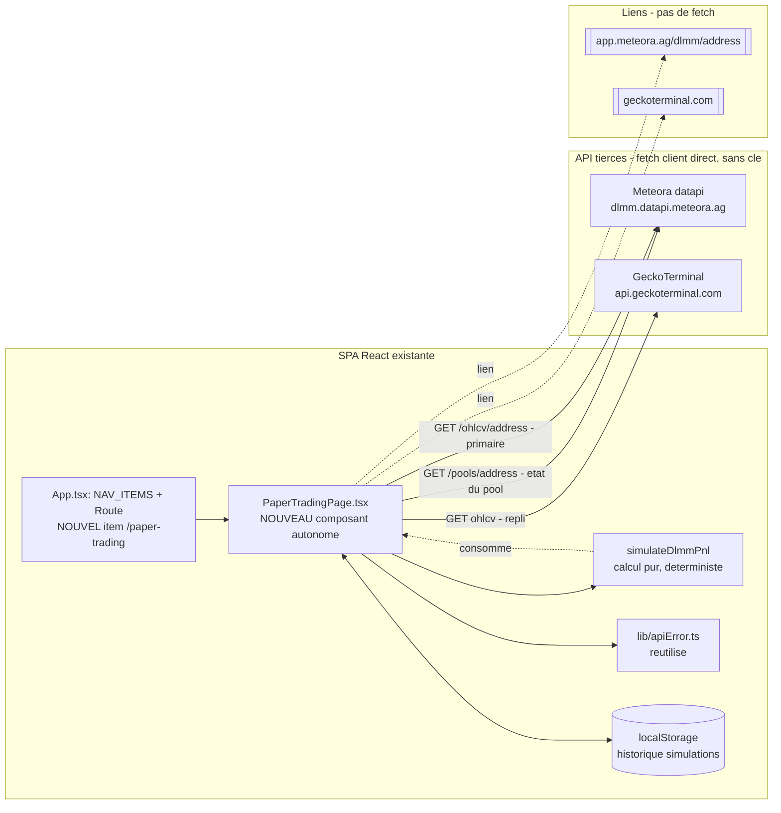

# Spécification technique — Paper trading DLMM

> Complément technique de `SPECIFICATION-FONCTIONNELLE.md`. Architecture de la page, endpoints
> exacts, modèle de données, **algorithme de simulation détaillé** (le cœur), gestion d'erreurs par
> source, schéma `localStorage`, risques techniques.
> Version 1 — 2026-07-22. Statut : **spécifié, non implémenté**
> (`src/pages/PaperTradingPage.tsx`, route `/paper-trading`).
>
> Principe directeur : rester dans le modèle du projet — **page React autonome, 100 % cliente,
> `fetch` directs, aucune nouvelle dépendance npm, gestion d'erreur via `apiError.ts`, isolation des
> sources**. Le calcul de P&L est **pur, déterministe et local** (aucun aléatoire, aucun réseau une
> fois les données en main), ce qui le rend testable en isolation et reproductible.

---

## 1. Point de départ : ce que l'archi actuelle fournit déjà

SPA React 19 + Vite **sans backend** ; chaque page sous `src/pages/` est autonome (son fetch, son
état, ses erreurs, son rendu inline monospace). Seul code partagé : `src/lib/apiError.ts`. Routing
dans `src/App.tsx` (`react-router-dom` + `NAV_ITEMS`).

La page réutilise tout ce socle et **deux patterns déjà présents dans le repo** :
- **datapi Meteora côté client** : `src/pages/PoolsPage.tsx` appelle déjà
  `https://dlmm.datapi.meteora.ag/pools?...` en `fetch` direct sans souci CORS. Les champs de pool
  (`pool_config.bin_step`, `pool_config.base_fee_pct`, `tvl`, `current_price`, `volume`, `fees`,
  `token_x`/`token_y`) y sont **déjà typés** (interfaces `MeteoraPool`, `PoolConfig`, `TimeWindowData`).
- **OHLCV normalisé** : `indicator-alerter/ohlcvClient.ts` sait déjà récupérer et normaliser des
  bougies **fermées** GeckoTerminal (drop de la bougie en cours, tri chronologique). La logique est
  transposable côté page (le fichier de l'alerter est Node/TS, mais l'algorithme est identique).

Différence structurante avec les pages de listing : **pas de polling**. La page a deux déclencheurs
manuels — « charger le pool » puis « lancer la simulation » — donc aucun `setInterval` à nettoyer,
juste des handlers `async` + un calcul pur.

Aucune donnée partagée avec les autres pages → aucun store, aucune modif des autres pages. Seul
fichier existant **modifié** : `src/App.tsx` (route + item de nav).

---

## 2. Vue d'ensemble de l'architecture



La page est **additive** : elle ajoute un fichier `src/pages/` (+ éventuellement un module de calcul
extrait, cf. §3) et deux lignes dans `src/App.tsx`.

---

## 3. Composant & structure de la page

### Fichier : `src/pages/PaperTradingPage.tsx`
Nom cohérent avec les autres (`FilterPage`, `PoolsPage`, `TokenScannerPage`…). Export par défaut du
composant.

### Module de calcul (recommandé) : `src/pages/paperTrading/simulate.ts`
Le cœur (maths DLMM du §6) est extrait dans un **module pur, sans React ni `fetch`** — fonctions
exportées (`binPrice`, `strategyWeights`, `simulateDlmmPnl`, …). Justification : c'est la partie la
plus dense et la seule vraiment **testable en isolation** (entrées → sortie déterministes), et
l'extraire évite un `PaperTradingPage.tsx` monolithique. Alternative acceptable si on veut coller
strictement au style « tout dans le fichier de page » des autres pages : garder ces fonctions en
tête de `PaperTradingPage.tsx` comme les helpers `formatAge()`. **Recommandation : module séparé**,
pour la testabilité du modèle.

### Route & navigation (`src/App.tsx`)
- Ajouter `{ to: "/paper-trading", label: "Paper Trading" }` à `NAV_ITEMS`.
- Ajouter `<Route path="/paper-trading" element={<PaperTradingPage />} />` et l'import.

### État interne (isolation par source + résultat local)
```ts
type BlockState<T> =
  | { status: "idle" }
  | { status: "loading" }
  | { status: "ok"; data: T }
  | { status: "notFound" }               // pool inconnu de Meteora (404 / vide)
  | { status: "error"; message: string }; // formatApiFailure(...)

// Entrées formulaire
poolAddress: string                        // saisie brute
form: {
  rangeBins: number;                       // nb de bins de part et d'autre du bin actif (>=1)
  strategy: "spot" | "curve" | "bidask";
  amountUsd: number;                       // capital virtuel en $
  window: "24h" | "7d";
  liquidityAssumption: "solo" | "poolShare"; // RG-08
}

// Données chargées / résultat
pool: BlockState<PoolState>                 // etat du pool (Meteora)
candles: BlockState<Candle[]>               // OHLCV ferme (source primaire ou repli)
result: SimulationResult | null             // sortie du calcul pur
warnings: string[]                          // avertissements de fiabilite (RG-07)
history: SimulationHistoryEntry[]           // localStorage
```

### Handlers (déclenchement manuel, pas de polling)
```
onLoadPool():
  1. valider poolAddress (RG-01) -> sinon message, return (aucun fetch)
  2. pool <- loading ; fetch GET /pools/{address} (Meteora)
  3. 404/vide -> pool = notFound ; 4xx/5xx/timeout/CORS -> pool = error (apiError)
  4. ok -> pool = ok(PoolState) ; pre-remplir les bornes de plage par defaut

onSimulate():
  1. exiger pool.status === "ok" ; valider form (RG-01) -> sinon message, return
  2. candles <- loading ; fetch OHLCV (primaire Meteora, repli GeckoTerminal) sur la fenetre
  3. echec des deux -> candles = error, pas de result
  4. bougies insuffisantes (RG-12) -> refus + message ; peu de bougies -> warning (RG-07)
  5. result = simulateDlmmPnl(pool.data, candles.data, form)  // calcul PUR, local
  6. pousser l'entree dans l'historique (localStorage)
```

- `AbortController` par appel réseau, annulé si l'utilisateur relance avant la fin (évite qu'une
  réponse tardive écrase l'affichage courant — même parade que `TokenScannerPage`).
- Réutilisation OHLCV : si `onSimulate` est relancé sans changer ni le pool ni la fenêtre, **ne pas
  re-fetch** — recalculer sur `candles.data` déjà en mémoire (US-05). Un changement de plage /
  stratégie / montant / hypothèse ne touche **que** le calcul pur.

---

## 4. Sources de données — endpoints exacts & champs utiles

### 4.1 État du pool — datapi Meteora (gratuit, sans clé)

```
GET https://dlmm.datapi.meteora.ag/pools/{poolAddress}
Accept: application/json
```

- Endpoint pool unique confirmé par la référence de la datapi (chemin `/pools/{address}`, host
  identique à `/pools` déjà utilisé par `PoolsPage`). **À confirmer au Lot 1** que la réponse d'un
  pool unique porte la même forme que les éléments de `data[]` de `/pools` (mêmes champs
  `pool_config`, `tvl`, `current_price`, `volume`, `fees`, `token_x`, `token_y`). Repli si le pool
  unique n'est pas exposé tel quel : réutiliser `GET /pools?...` et filtrer par adresse (moins
  efficace mais garanti par l'existant).
- Champs utiles (déjà typés dans `PoolsPage.tsx`) :

| Champ | Usage dans la simulation |
|-------|--------------------------|
| `pool_config.bin_step` | `binStep` (bps) → prix des bins (§6). |
| `pool_config.base_fee_pct` | Repli du taux de frais (RG-05). |
| `current_price` | Prix actif de départ ; centre de la plage par défaut. |
| `tvl` | Estimation de la liquidité concurrente (mode « part du pool », RG-08). |
| `volume` (`TimeWindowData`: `30m..24h`) | Taux de frais effectif = `fees / volume` (RG-05) ; sanity-check du volume rejoué. |
| `fees` (`TimeWindowData`) | Numérateur du taux de frais effectif. |
| `token_x`, `token_y` (symbol, decimals) | Libellés d'affichage, sens de la paire. |
| `created_at` | Âge du pool (affichage) ; borne l'historique disponible. |

> `TimeWindowData` n'a pas de clé `7d`. Pour la fenêtre 7 j, le taux de frais effectif repli sur
> `24h` (le plus large disponible) ou sur `base_fee_pct` ; l'origine est affichée (O4, RG-05).

### 4.2 Historique OHLCV — primaire Meteora, repli GeckoTerminal (gratuit, sans clé)

**Primaire — datapi Meteora** (même host que l'état du pool, prix aligné sur les termes du pool) :
```
GET https://dlmm.datapi.meteora.ag/ohlcv/{poolAddress}?timeframe={tf}&start_time={s}&end_time={e}
Accept: application/json
```
- `timeframe` ∈ `5m,30m,1h,2h,4h,12h,24h` ; `start_time`/`end_time` en **secondes Unix**.
- **CORS de `/ohlcv/{address}` à confirmer** au Lot 1 (host identique à `/pools` déjà OK → forte
  probabilité). Forme de réponse à observer au Lot 1 (liste de bougies `[ts, o, h, l, c, v]` ou
  objet) et à normaliser.

**Repli — GeckoTerminal** (éprouvé dans le repo, cf. `indicator-alerter/ohlcvClient.ts`) :
```
GET https://api.geckoterminal.com/api/v2/networks/solana/pools/{poolAddress}/ohlcv/{tf}
    ?aggregate={n}&limit={limit}&currency=usd
Accept: application/json
```
- Ex. bougies 15 min : `.../ohlcv/minute?aggregate=15&limit=…&currency=usd` (pattern exact de
  `ohlcvClient.ts`). Réponse : `data.attributes.ohlcv_list` = `[[ts, o, h, l, c, v], …]`.
- **Anti-repainting obligatoire** : on ne garde que les bougies **fermées** (`ts + tfSeconds <=
  now`), triées ancien → récent — même règle que `ohlcvClient.ts`. Une position ne « gagne » que sur
  des segments de temps révolus.

**Choix de granularité selon la fenêtre** (pour garder un nombre de bougies raisonnable) :

| Fenêtre | Granularité bougie | ~nb de bougies |
|---------|--------------------|----------------|
| 24 h | 15 min | ~96 |
| 7 j | 1 h | ~168 |

> Le prix GeckoTerminal est en **USD**, le prix Meteora dans les **termes du pool**. Le modèle §6
> travaille en unités de prix cohérentes **au sein d'une même série** (la plage et l'IL sont
> relatifs) ; le montant virtuel et les frais sont exprimés en **USD** (le volume Meteora et le TVL
> sont déjà en USD). Si la source primaire Meteora donne un prix en quote non-USD, convertir via le
> ratio `current_price` (déjà en USD dans `PoolsPage`) — à valider au Lot 1 selon la forme réelle.

### 4.3 Liens externes (aucun fetch)
- Meteora : `https://app.meteora.ag/dlmm/{poolAddress}` (déjà utilisé par `PoolsPage`).
- GeckoTerminal : `https://www.geckoterminal.com/solana/pools/{poolAddress}`.
- `<a target="_blank" rel="noreferrer">`.

---

## 5. Décision de cadrage — source OHLCV

**Primaire : datapi Meteora `GET /ohlcv/{address}`. Repli : GeckoTerminal.** Justification :
1. **Un seul host** pour l'état du pool ET l'historique (`dlmm.datapi.meteora.ag`), CORS déjà validé
   côté client par `PoolsPage` pour `/pools` (le sous-chemin `/ohlcv` reste à confirmer mais très
   probable).
2. Prix **aligné sur les termes du pool** → cohérent avec le calcul des bins (§6), pas de conversion
   USD⇄quote parasite.
3. GeckoTerminal reste un **repli robuste et déjà éprouvé** (`ohlcvClient.ts`) si la datapi OHLCV
   déçoit (CORS, forme, historique trop court).

Si au Lot 1 la datapi OHLCV s'avère inutilisable côté client (CORS, forme illisible, fenêtre trop
courte), **inverser** : GeckoTerminal en primaire (connu bon), Meteora abandonné pour l'OHLCV. Ce
basculement ne change **pas** le reste de l'archi (le calcul §6 consomme une liste `Candle[]`
normalisée, indépendante de la source).

---

## 6. Algorithme de simulation (le cœur) — `simulateDlmmPnl`

> **But** : à partir de l'état du pool, d'une série de bougies fermées et des paramètres de position,
> produire un P&L **estimé** décomposé. Fonction **pure et déterministe** (aucun `fetch`, aucun
> aléatoire). Toutes les approximations sont listées §11 fonctionnel (Q1-Q3, Q9) et **affichées**.

### 6.1 Grille de bins et bornes de plage
- Prix du bin d'index relatif `i` (0 = bin actif de départ, prix `p0 = current_price`) :
  ```
  binPrice(i) = p0 * (1 + binStep/10000)^i
  ```
- Plage choisie : `rangeBins` de chaque côté → indices `i ∈ [-rangeBins, +rangeBins]`, soit
  `N = 2*rangeBins + 1` bins. Bornes : `pLower = binPrice(-rangeBins)`, `pUpper = binPrice(+rangeBins)`.
- **Largeur de plage** affichée (RG-03) : `(1 + binStep/10000)^rangeBins − 1` (en % de part et
  d'autre du prix actif).

### 6.2 Poids de distribution par stratégie (RG-04, approximation Q1)
Pour chaque bin `i ∈ [-rangeBins, rangeBins]`, un poids `w_i ≥ 0`, **normalisé** (`Σ w_i = 1`),
puis `L_i = amountUsd * w_i` = capital virtuel déposé dans le bin `i`.

| Stratégie | Poids `w_i` (avant normalisation) | Forme |
|-----------|-----------------------------------|-------|
| `Spot` | `1` (constant) | Uniforme |
| `Curve` | `1 - |i|/(rangeBins+1)` (triangulaire), ou gaussienne `exp(-(i/σ)²)` | Concentré au centre |
| `BidAsk` | `|i|/rangeBins + ε` (V inversé) | Concentré aux bords |

> **Approximation assumée (Q1)** : ce ne sont **pas** les formules exactes du SDK Meteora (référence
> non accessible lors de la recherche). Elles reproduisent la **forme** correcte de chaque stratégie.
> Facilement remplaçables si la formule exacte est confirmée — d'où l'isolation de `strategyWeights`
> dans un module pur.

### 6.3 Rejeu bougie par bougie
Séquence chronologique de bougies fermées `C_0 … C_{n-1}`, chacune `{ts, open, high, low, close,
volume}` (volume en USD). État courant du prix `pStart = C_0.open` (≈ `p0`).

Pour chaque bougie `C_k` :

**(a) Frais collectés sur la bougie** (RG-05, RG-06, approximation Q3)
1. `feeRate` = taux de frais effectif : `min(pool.fees[tf] / pool.volume[tf], base_fee_pct)` si
   `volume[tf] > 0` et cohérent, sinon `base_fee_pct` (origine affichée). *(taux constant sur la
   fenêtre au MVP — le fee dynamique par bougie est hors scope, §5 Won't.)*
2. Intervalle de prix traversé par la bougie : `[C_k.low, C_k.high]`. Intersection avec la plage :
   `[max(low, pLower), min(high, pUpper)]`. Si vide → **0 frais** (RG-06), passer à (b).
3. Fraction du volume de la bougie tombée **dans la plage** :
   `frac = (segment intersecté) / (high − low)` (répartition **uniforme** du volume sur `[low,high]`
   — approximation Q3 ; si `high == low`, `frac = 1` si le prix est dans la plage, sinon 0).
   `volInRange = C_k.volume * frac`.
4. Frais générés par le pool sur `volInRange` : `feesGenerated = volInRange * feeRate`.
5. Part revenant à la position selon l'hypothèse de liquidité (RG-08) :
   - **`solo`** (borne haute) : `feesLP = feesGenerated` (vous captez tout le volume de vos bins).
   - **`poolShare`** (estimation) : votre part `share = L_active / (L_active + L_poolInRange)`, où
     `L_active` = somme des `L_i` des bins recouverts par le segment intersecté, et
     `L_poolInRange = pool.tvl * (nbBinsRecouverts / nbBinsTotalPlage)` (hypothèse d'uniformité du TVL
     sur la plage — approximation Q2). `feesLP = feesGenerated * share`.
6. Cumuler `totalFeesUsd += feesLP`. Cumuler le temps « dans la plage » si `C_k.close ∈ [pLower,
   pUpper]` (pour `timeInRangePct`).

**(b) Avancer le prix** : `pPrev = C_k.open`, `pNow = C_k.close`. La position se recompose selon la
formule de liquidité concentrée (6.4) au fil des bougies.

### 6.4 Valeur de position vs hold & impermanent loss (concentré)
Modélisation en **liquidité concentrée continue** sur `[pLower, pUpper]` (approximation continue de
la grille de bins — l'effet de discrétisation par bin est négligé au MVP, documenté) :

- Composition initiale à `p0` : pour une liquidité `L` déposée uniformément en valeur sur la plage
  (ajustée par les poids §6.2 pour `Curve`/`BidAsk` via une liquidité effective par sous-intervalle),
  les quantités de token X et Y sont données par les formules standard de liquidité concentrée
  (type Uniswap v3), avec :
  - si `p ≤ pLower` : position 100 % en token de base (X) ;
  - si `p ≥ pUpper` : position 100 % en token quote (Y) ;
  - si `pLower < p < pUpper` : mélange, quantités fonction de `√p`, `√pLower`, `√pUpper`.
- `valuePosition(p) =` valeur en USD des quantités X,Y de la position au prix `p` **+** `totalFeesUsd`.
- `valueHold(p) =` valeur en USD des quantités **initiales** (celles déposées à `p0`) réévaluées à
  `p`, **sans** fournir de liquidité (pas de recomposition, pas de frais).
- Au dernier prix `pEnd = C_{n-1}.close` :
  - `impermanentLossUsd = valueHoldNoFees(pEnd) − valuePositionNoFees(pEnd)` (peut être négatif =
    gain de composition, rare) ;
  - `netPnlUsd = totalFeesUsd − impermanentLossUsd` ;
  - `netPnlPct = netPnlUsd / amountUsd`.

> **Note de modélisation (Q1/Q2/Q3)** : pour `Spot`, la formule concentrée continue est directement
> applicable. Pour `Curve`/`BidAsk`, le MVP peut soit (i) approximer par une liquidité concentrée
> uniforme équivalente pondérée, soit (ii) sommer la contribution par bin discret (plus fidèle aux
> poids §6.2, plus coûteux). **Recommandation MVP** : sommation par bin discret pour l'IL et les
> frais (les deux boucles parcourent déjà les bins de la plage), ce qui rend les trois stratégies
> réellement différenciées. Le choix (i vs ii) est un détail d'implémentation à figer au Lot 2 ; il
> ne change pas les entrées/sorties publiques de `simulateDlmmPnl`.

### 6.5 Sortie
```ts
interface SimulationResult {
  totalFeesUsd: number;
  impermanentLossUsd: number;      // > 0 = perte vs hold
  netPnlUsd: number;               // fees - IL
  netPnlPct: number;               // netPnlUsd / amountUsd
  valuePositionUsd: number;        // valeur finale position (frais inclus)
  valueHoldUsd: number;            // valeur finale d'un hold simple
  timeInRangePct: number;          // 0..1
  candlesReplayed: number;
  feeRateUsed: number;
  feeRateSource: "effective" | "baseFee"; // origine (O4)
  liquidityAssumption: "solo" | "poolShare";
  priceStart: number;
  priceEnd: number;
  rangeLowerPrice: number;
  rangeUpperPrice: number;
}
```
Tous les champs alimentent l'affichage (§8 fonctionnel) **et** le bandeau d'hypothèses (O4). Aucun
n'est masqué.

---

## 7. Modèle de données (types côté client uniquement)

Aucune base, aucune persistance serveur : des **interfaces TypeScript** locales à la page. Réutiliser
les types déjà écrits dans `PoolsPage.tsx` (`MeteoraPool`, `PoolConfig`, `TimeWindowData`,
`TokenMetrics`) — soit en les important si on les extrait dans un module partagé, soit en les
redéclarant localement (le projet redéclare volontairement ses types par page ; les extraire est une
option, pas une obligation).

```ts
// Bougie normalisee (meme forme que indicator-alerter/types Candle)
interface Candle { ts: number; open: number; high: number; low: number; close: number; volume: number; }

// Etat du pool reduit a ce dont le calcul a besoin
interface PoolState {
  address: string;
  tokenXSymbol: string;
  tokenYSymbol: string;
  binStep: number;          // pool_config.bin_step
  baseFeePct: number;       // pool_config.base_fee_pct
  currentPrice: number;     // current_price (USD)
  tvlUsd: number;           // tvl
  volume: TimeWindowData;   // pour taux de frais effectif
  fees: TimeWindowData;
  createdAt: number;
}
```

Formes **tolérantes** (champs optionnels au parse) car les réponses tierces ne sont pas sous notre
contrôle ; on **échoue proprement** (message) si un champ vital manque plutôt que de calculer sur
`undefined`.

---

## 8. Persistance — schéma `localStorage`

Réutilise le pattern exact de `TokenScannerPage.tsx` (`loadHistory`/`saveHistory`/`sortHistory`,
try/catch silencieux, favoris jamais évincés, plafond des non-favoris).

```ts
const HISTORY_STORAGE_KEY = "paper-trading-history";
const MAX_NON_FAVORITE_HISTORY = 20;

interface SimulationHistoryEntry {
  id: string;                 // uuid/timestamp
  createdAt: number;          // Date.now()
  favorite: boolean;
  poolAddress: string;
  poolLabel: string;          // ex. "SOL/USDC" pour reconnaissance rapide
  params: {                   // pour re-remplir le formulaire (RG-10)
    rangeBins: number;
    strategy: "spot" | "curve" | "bidask";
    amountUsd: number;
    window: "24h" | "7d";
    liquidityAssumption: "solo" | "poolShare";
  };
  resultSnapshot: {           // instantane synthetique au moment du calcul (RG-10)
    netPnlUsd: number;
    netPnlPct: number;
    totalFeesUsd: number;
    impermanentLossUsd: number;
    timeInRangePct: number;
    feeRateSource: "effective" | "baseFee";
  };
}
```

Règles (identiques au scanner) :
- `loadHistory()` : parse défensif, filtre les entrées malformées, repli `[]` si `localStorage`
  indisponible/corrompu (US-06).
- `saveHistory()` : try/catch silencieux (quota/indispo → l'historique reste en mémoire pour la
  session).
- Tri : favoris d'abord, puis plus récent d'abord.
- Éviction : à l'ajout, si > `MAX_NON_FAVORITE_HISTORY` non-favoris, évincer le plus ancien
  **non-favori** ; ne jamais évincer un favori.
- **`resultSnapshot` est un instantané** : rouvrir une entrée re-remplit `params` et relance un
  calcul **sur les données du moment** (RG-10) ; le snapshot sert seulement à afficher l'historique
  sans recalcul.

---

## 9. Gestion d'erreurs par source (isolation)

Reprend l'isolation du scanner / de `alerter/notifier.ts` :
- **État du pool** (Meteora) et **OHLCV** sont deux étapes distinctes avec leur propre
  `BlockState`. Un échec de l'un ne produit **jamais** un P&L partiel (RG-11) : sans état de pool
  valide **ou** sans bougies suffisantes, `simulateDlmmPnl` n'est **pas** appelé.
- Sur `res.ok === false` → `readApiFailure("Meteora" | "GeckoTerminal", res)` puis `formatApiFailure`
  (réutilisation directe de `src/lib/apiError.ts`).
- Exceptions réseau (dont **CORS** et **timeout** via `AbortController`) → `BlockState.error` avec
  message clair.
- **OHLCV** : tenter la primaire (Meteora), sur échec tenter le repli (GeckoTerminal) ; les **deux**
  en échec → `error`, aucun résultat. Un repli réussi est signalé discrètement (« source de repli
  utilisée ») pour la transparence (O4).
- Distinguer **404/vide Meteora** (`notFound`, « pool introuvable ») d'une **panne d'infra**
  (`error`) — un pool inconnu n'est pas une erreur serveur.
- **Refus vs avertissement** : bougies < seuil minimal (RG-12) → refus explicite (pas de calcul) ;
  bougies présentes mais peu nombreuses / taux de frais indéductible → calcul **avec** avertissement
  de fiabilité (RG-07).

---

## 10. Sécurité, dépendances & risques techniques

### Sécurité
- **Aucun secret** : sources publiques sans clé → rien dans `.env`, aucune rupture du modèle « tout
  client ». **Aucun wallet, aucune signature** (RG-13) : rien n'est jamais envoyé qui ne soit l'
  **adresse publique du pool**.
- Liens externes en `rel="noreferrer"`. Pas d'iframe tierce dans le MVP.

### Dépendances
- **Aucune nouvelle dépendance npm.** Uniquement `fetch` + `useState`/`useCallback`/`useRef` + du
  calcul JS pur. Le SDK `@meteora-ag/dlmm` (lourd) et `@solana/web3.js` ne sont **pas** requis :
  aucune transaction, aucune lecture on-chain au MVP (la lecture on-chain de la distribution par bin
  est la piste post-MVP Q5, qui les introduirait — hors scope ici).

### Risques techniques

| ID | Risque | Prob. | Impact | Mitigation |
|----|--------|-------|--------|------------|
| R1 | **Précision du modèle** : sans distribution de liquidité par bin (Q2) ni volume par bin (Q3), les montants absolus de frais sont approximatifs | Certaine | P&L en valeur absolue imprécis | Afficher les hypothèses en permanence (O4) ; offrir « solo » (borne haute) vs « part du pool » pour **encadrer** ; privilégier l'usage **comparatif** (config A vs B) où les biais se compensent partiellement ; documenter comme estimation, jamais comme vérité |
| R2 | **Formules `Spot`/`Curve`/`BidAsk` exactes inconnues** (Q1) | Moyenne | Différenciation entre stratégies approximative | Approximations documentées, isolées dans `strategyWeights` (remplaçables) ; forme qualitative correcte |
| R3 | **CORS / forme de `/ohlcv/{address}` Meteora non confirmée** (Q4) | Moyenne | Source primaire OHLCV inutilisable | Repli GeckoTerminal **déjà éprouvé** (`ohlcvClient.ts`) ; le calcul consomme un `Candle[]` normalisé indépendant de la source ; bascule sans refonte (§5) |
| R4 | **Cohérence des unités de prix** (USD GeckoTerminal vs quote Meteora) | Moyenne | IL/frais faussés si mélange d'unités | Travailler dans une **seule** série cohérente ; exprimer frais/montant en USD via `current_price` (déjà USD) ; valider au Lot 1 sur un pool connu |
| R5 | **`TimeWindowData` sans clé `7d`** | Faible | Taux de frais 7 j approximé | Repli sur `24h` puis `base_fee_pct`, origine affichée (RG-05) |
| R6 | **Historique OHLCV trop court** (pool récent, `limit` API) | Moyenne | Fenêtre 7 j incomplète | Simuler sur les bougies dispo + avertissement (RG-07) ou refus (RG-12) ; borner par `created_at` |
| R7 | **Rate limit tiers** (Meteora 30 req/s, GeckoTerminal) | Faible | Chargement ponctuellement en erreur | Usage à la demande (2 fetch/simulation, pas de polling) ; `apiError.ts` gère 429 ; relance manuelle |
| R8 | **Réponse tardive écrase la simulation courante** | Faible | Affichage incohérent | `AbortController` par appel, annulé au relancement (§3) |

---

## 11. Impacts sur l'existant

- **`src/App.tsx`** : +1 import, +1 `NAV_ITEMS`, +1 `<Route>` (seul fichier existant modifié).
- **`src/lib/apiError.ts`** : **réutilisé tel quel**, aucune modif.
- **`src/pages/PoolsPage.tsx`** : non modifié ; ses **types** (`MeteoraPool`…) peuvent être
  réutilisés (import si extraction en module partagé, sinon redéclaration locale — au choix, sans
  impact sur PoolsPage).
- Nouveaux fichiers : `src/pages/PaperTradingPage.tsx` (+ `src/pages/paperTrading/simulate.ts`
  recommandé).
- Autres pages, `alerter/`, `indicator-alerter/`, build : **aucun impact** (page autonome, pas de
  nouvelle dépendance, pas de nouvelle variable d'env, `npm run build` inchangé hormis les nouveaux
  fichiers type-checkés).

---

## 12. Tests

> Pas de runner de test dans le projet (cf. CLAUDE.md) → **validation manuelle** + relecture. **Mais**
> le module `simulate.ts` étant pur et déterministe, il est le **candidat idéal** à des vérifications
> par cas connus (cf. dernière ligne) même sans framework : un petit script de sanity-check ad hoc
> (ex. via Node natif, comme les scripts `alerter/`) peut valider les invariants ci-dessous.

| Niveau | Cible | Vérification |
|--------|-------|--------------|
| Manuel | Validation entrées (RG-01) | Adresse vide/hors base58, montant ≤ 0, bins < 1 → message, **aucun** appel réseau (onglet Réseau vide) |
| Manuel | Pool introuvable (RG-02) | Adresse plausible inconnue → « introuvable », pas d'erreur d'infra, pas de paramètres inventés |
| Manuel | Isolation sources (RG-11) | Meteora down → message ciblé, pas de simulation ; OHLCV primaire down → repli GeckoTerminal utilisé et signalé |
| Manuel | Fenêtre 24 h / 7 j | Nombre de bougies cohérent avec la granularité (§4.2) ; anti-repainting (dernière bougie ouverte exclue) |
| Manuel | Cas « hors plage » (RG-06) | Plage volontairement décalée → 0 frais, message explicite, `timeInRangePct` = 0 |
| Manuel | Fiabilité dégradée (RG-07/RG-12) | Pool très récent (peu de bougies) → avertissement ou refus selon le seuil |
| Manuel | Historique/favoris (US-06) | Simulation → entrée créée ; favori jamais évincé ; `localStorage` privé/corrompu → repli vide sans crash |
| Invariants | `simulateDlmmPnl` (module pur) | (a) prix constant ⇒ IL ≈ 0 ; (b) `Spot` ⇒ poids uniformes, `Σw=1` ; (c) `feesLP(solo) ≥ feesLP(poolShare)` toutes choses égales (borne haute) ; (d) plage entièrement hors trajectoire ⇒ `totalFeesUsd = 0` ; (e) déterminisme : mêmes entrées ⇒ même sortie ; (f) `netPnlUsd = totalFeesUsd − impermanentLossUsd` |
| Manuel | Cohérence unités (R4) | Sur un pool connu (ex. SOL/USDC), ordre de grandeur du P&L plausible vs intuition |
| Build | Type-check | `npm run build` passe (nouveaux fichiers compilés sans erreur TS) |
```
