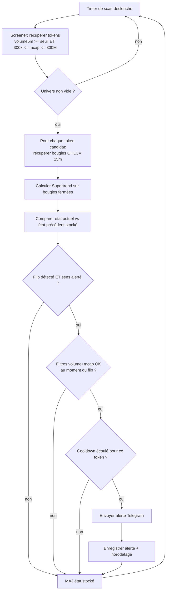

# Spécification fonctionnelle — Alertes Telegram « Supertrend Breakout »

> Périmètre : nouveau système de **notification** qui alerte (Telegram) quand un token
> Solana remplit trois critères combinés : volume 5 min élevé, market cap dans une fourchette
> « shitcoin établi », et **cassure du Supertrend** sur le timeframe 15 minutes.
>
> Statut : spécification produit (aucune implémentation). Version 1 — 2026-07-16.

---

## 1. Contexte & problème

### Le besoin
L'application actuelle (`solana-meteora-filter`) est une SPA React 100 % côté client qui affiche,
sur plusieurs pages, des tokens Solana filtrés par volume 5 min et market cap (Birdeye,
GeckoTerminal, DexScreener, Solana Tracker) et les derniers pools Meteora DLMM. Elle est
**passive** : l'utilisateur doit garder un onglet ouvert et scruter des tableaux qui se
rafraîchissent toutes les 15-30 s.

Le propriétaire (Enzo) veut passer d'une veille manuelle à une **veille active** : recevoir une
**notification poussée** (Telegram) au moment précis où un token combine :

1. un **volume 5 min significatif** (momentum de trading immédiat) ;
2. un **market cap entre 300 k$ et 300 M$** (ni micro-cap tout frais et illiquide, ni méga-cap
   sans potentiel de mouvement rapide — un « shitcoin plutôt établi ») ;
3. un **flip du Supertrend** (indicateur ATR) sur les bougies **15 minutes** — c.-à-d. un
   changement de tendance qui sert de signal d'entrée/sortie technique.

### Pourquoi maintenant
Les trois signaux existent séparément mais aucun n'est combiné ni poussé. Surveiller les
graphiques 15 min de dizaines de tokens à la main est impossible. L'automatisation de la
détection du flip Supertrend + les filtres volume/mcap transforme l'outil de « tableau de bord »
en « système d'alerte exploitable ».

### Contrainte structurante
Un bot Telegram exige un **token secret côté serveur**. L'architecture actuelle est 100 % client
(toutes les clés sont `VITE_`-préfixées et embarquées dans le bundle, donc publiques). **Ce
projet introduit nécessairement un composant serveur/serverless** — voir la spécification
technique.

---

## 2. Objectifs & résultats attendus

| # | Objectif | Résultat mesurable |
|---|----------|--------------------|
| O1 | Détecter automatiquement les tokens remplissant les 3 critères | ≥ 1 pipeline qui évalue les critères sans intervention humaine |
| O2 | Notifier l'utilisateur en quasi temps réel | Alerte reçue sur Telegram **≤ 60 s** après la clôture de la bougie 15 min déclenchante |
| O3 | Éviter le spam | **0** alerte dupliquée pour un même flip ; cooldown respecté (cf. RG-07) |
| O4 | Fiabilité | Le pipeline tourne en continu ; une panne d'API tierce ne stoppe pas le service (dégradation, reprise auto) |
| O5 | Message actionnable | Chaque alerte contient assez d'infos pour décider en < 10 s (symbole, mcap, volume, prix, sens du flip, liens) |
| O6 | Coût maîtrisé | Fonctionnement dans une enveloppe **gratuite ou quasi gratuite** (à valider — cf. Q4) |

---

## 3. Personas / utilisateurs cibles

- **Enzo (trader-scout, utilisateur unique du MVP)** : surveille des shitcoins Solana, veut être
  alerté sur son téléphone pour saisir un momentum. Techniquement à l'aise, sait lire un
  graphique et un indicateur ATR/Supertrend. Ne veut pas être noyé sous les alertes.
- **(Éventuel, post-MVP) Petit groupe / canal Telegram** : plusieurs abonnés reçoivent les mêmes
  alertes via un canal ou groupe Telegram. Hors périmètre MVP (cf. §5).

---

## 4. Glossaire

- **OHLCV** : Open / High / Low / Close / Volume — une « bougie » sur une période donnée.
- **Supertrend** : indicateur de suivi de tendance basé sur l'ATR (Average True Range). Il
  produit une ligne « stop suiveur » et un **état de tendance** (haussier / baissier). Voir la
  spec technique pour la formule exacte.
- **Flip / cassure** : moment où l'état du Supertrend passe de baissier → haussier (flip
  **haussier**) ou de haussier → baissier (flip **baissier**).
- **ATR period** : nombre de bougies utilisées pour lisser l'ATR (défaut proposé : 10).
- **Multiplier** : coefficient appliqué à l'ATR pour écarter les bandes (défaut proposé : 3).
- **Bougie fermée** : bougie dont la période est terminée (par ex. la bougie 15 min de 14h00
  n'est « fermée » qu'à 14h15). Le Supertrend n'est évalué **que sur bougies fermées** pour
  éviter les faux signaux d'une bougie en cours (repainting).

---

## 5. Périmètre

### Inclus (MVP)
- Un pipeline serveur/serverless qui, en continu :
  - construit un **univers de tokens candidats** à partir des screeners déjà utilisés
    (volume 5 min ≥ seuil ET 300 k$ ≤ mcap ≤ 300 M$) ;
  - récupère les **bougies OHLCV 15 min** de ces candidats ;
  - calcule le **Supertrend** et détecte les **flips** entre la dernière évaluation et la nouvelle ;
  - envoie une **alerte Telegram** quand un flip qualifiant survient sur un token qui passe les
    filtres volume + mcap, en respectant dédup et cooldown.
- Un message d'alerte formaté (cf. §8).
- Une **configuration centralisée** des seuils et paramètres (volume, mcap min/max, ATR period,
  multiplier, sens du flip, cooldown, intervalle de scan).
- Gestion des erreurs / rate-limits des API tierces sans arrêt du service.

### Exclu / repoussé (Won't, cette version)
- Interface web de configuration des alertes (les seuils sont dans la config/env au MVP).
- Multi-utilisateurs, comptes, abonnements, gestion de canal public.
- Autres canaux que Telegram (Discord, e-mail, webhook) — architecture prévue extensible, mais
  non implémentée.
- Passage d'ordres / exécution de trade automatique. **Le système alerte, il ne trade jamais.**
- Backtest historique de la stratégie Supertrend.
- Persistance long terme / historique consultable des alertes au-delà de l'état minimal
  nécessaire à la dédup.
- Intégration des pools Meteora DLMM dans les alertes (le focus est le token, pas le pool).
- **Alertes sur flip baissier** : décision explicite d'Enzo, hors périmètre définitivement (pas
  seulement repoussé) — voir US-06 révisée et RG-06.

---

## 6. User stories & critères d'acceptation

> Traçabilité : chaque US référence l'objectif qu'elle sert (O1-O6).

### US-01 — Recevoir une alerte de flip Supertrend haussier *(O1, O2, O5)*
**En tant que** trader-scout, **je veux** recevoir une notification Telegram quand un token
qualifiant voit son Supertrend 15 min passer baissier → haussier, **afin de** saisir un point
d'entrée potentiel dès la clôture de la bougie.

Critères d'acceptation :
- **Given** un token dont le mcap ∈ [300 k$, 300 M$] et le volume 5 min ≥ seuil,
  **when** la bougie 15 min qui vient de se fermer fait passer le Supertrend de baissier à
  haussier, **then** une alerte Telegram est envoyée **≤ 60 s** après la clôture de bougie.
- **Given** le même token, **when** aucun flip n'a eu lieu sur la dernière bougie fermée,
  **then** aucune alerte n'est envoyée.
- L'alerte contient au minimum : symbole, adresse (mint), mcap, volume 5 min, prix, sens du flip
  (« haussier »), horodatage de la bougie déclenchante, et au moins un lien externe
  (DexScreener / GeckoTerminal). *(cf. §8)*

### US-02 — Ne pas être spammé pour un même signal *(O3)*
**En tant que** trader-scout, **je veux** ne recevoir qu'**une seule** alerte par flip,
**afin de** ne pas être noyé si le token reste plusieurs cycles dans les critères.

Critères d'acceptation :
- **Given** un token qui a déjà déclenché une alerte pour un flip haussier,
  **when** les scans suivants confirment que le Supertrend reste haussier (sans nouveau flip),
  **then** aucune nouvelle alerte n'est envoyée.
- **Given** un token déjà alerté, **when** son Supertrend flippe baissier puis re-flippe
  haussier, **then** une nouvelle alerte n'est envoyée **que si** le cooldown (RG-07) est écoulé.

### US-03 — Filtrer sur volume et market cap *(O1)*
**En tant que** trader-scout, **je veux** que seuls les tokens dont le volume 5 min et le mcap
sont dans mes bornes déclenchent des alertes, **afin de** ne cibler que des shitcoins établis et
liquides.

Critères d'acceptation :
- **Given** un token dont le mcap < 300 k$ **ou** > 300 M$, **when** son Supertrend flippe,
  **then** aucune alerte n'est envoyée.
- **Given** un token dont le volume 5 min < seuil au moment du flip, **when** son Supertrend
  flippe, **then** aucune alerte n'est envoyée.
- Les bornes (volume, mcap min, mcap max) sont lues depuis la configuration, pas codées en dur
  dans la logique métier.

### US-04 — Configurer les paramètres de détection *(O1, O6)*
**En tant que** propriétaire, **je veux** régler les seuils et paramètres (volume min, mcap
min/max, ATR period, multiplier, sens des flips alertés, cooldown, intervalle de scan)
**afin d'** ajuster la sensibilité sans redéployer du code métier.

Critères d'acceptation :
- Tous les paramètres de §9 (RG) sont modifiables via configuration (variables
  d'environnement / fichier de config), avec des **valeurs par défaut** documentées.
- Une valeur invalide (ex. mcap min > mcap max) est détectée au démarrage et **loggée**, le
  service refuse de démarrer plutôt que de tourner avec une config incohérente.

### US-05 — Le service survit aux pannes d'API *(O4)*
**En tant que** propriétaire, **je veux** que le pipeline continue de tourner malgré une API
tierce en erreur/rate-limit, **afin de** ne pas rater les alertes des cycles suivants.

Critères d'acceptation :
- **Given** un cycle de scan où une API renvoie 429/5xx/quota épuisé, **when** l'erreur survient,
  **then** l'erreur est loggée (réutiliser le format `apiError.ts`), le token concerné est
  **ignoré pour ce cycle**, et le scan suivant reprend normalement.
- **Given** une panne totale d'envoi Telegram, **when** un message ne peut être délivré,
  **then** l'échec est loggé et une politique de retry (cf. RG-09) s'applique.

### US-06 — (Won't) Flips baissiers exclus du périmètre *(décision explicite)*
**Décision actée par Enzo** : le système n'alerte **jamais** sur un flip baissier (le prix qui
repasse sous la ligne Supertrend). Seul le franchissement haussier (le prix qui repasse
au-dessus) est un signal exploitable pour ce cas d'usage. Ce n'est donc **pas** une option
configurable au sens de « les deux sens » — c'est une règle métier fixe (cf. RG-06 révisée).
Retiré du backlog (l'ancien T19 du plan de mise en œuvre est supprimé).

### US-07 — (Should) Message groupé / anti-rafale *(O3, O5)*
**En tant que** trader-scout, **je veux** que si plusieurs tokens flippent dans le même cycle,
les alertes restent lisibles, **afin de** ne pas recevoir 20 messages d'un coup.

Critères d'acceptation :
- **Given** N > seuil tokens qualifiants sur un même cycle, **when** les alertes sont envoyées,
  **then** elles sont soit throttlées (espacées pour respecter les limites Telegram), soit
  agrégées en un message récapitulatif (choix à trancher — cf. Q5).

---

## 7. Parcours utilisateur (vue macro)



---

## 8. Format du message d'alerte

Le message doit être **scannable en < 10 s** et actionnable. Proposition (Telegram, mode
Markdown/HTML) :

```
🚨 SUPERTREND FLIP HAUSSIER · $SYMBOL

Market cap : 4,2 M$
Volume 5m  : 128 340 $
Prix       : 0,00031 $
Timeframe  : 15m · bougie 14:15
Supertrend : baissier → haussier (ATR 10 ×3)

Mint : So1111...4x9  (tap pour copier)
🔗 DexScreener · 🔗 GeckoTerminal · 🔗 Birdeye
```

Règles de contenu :
- Emoji + titre = sens du flip immédiatement identifiable (🟢 haussier / 🔴 baissier).
- Montants formatés lisiblement (`toLocaleString`-like, abréviations k/M).
- Mint affiché tronqué mais copiable en entier ; liens externes cliquables.
- Horodatage = **heure de clôture de la bougie déclenchante** (pas l'heure d'envoi), pour lever
  toute ambiguïté sur le signal.
- Aucune donnée sensible (pas de clé API, pas de secret) dans le message.

---

## 9. Règles de gestion

> Les valeurs par défaut sont des **hypothèses** à valider (cf. §11). Chaque règle est
> configurable sauf mention contraire.

| ID | Règle | Valeur par défaut proposée | Configurable |
|----|-------|----------------------------|--------------|
| RG-01 | Volume 5 min minimum pour qu'un token soit candidat | `30 000 $` (aligné sur `MIN_VOLUME_5M` de l'app) | oui |
| RG-02 | Market cap minimum | `300 000 $` | oui |
| RG-03 | Market cap maximum | `300 000 000 $` | oui |
| RG-04 | Timeframe des bougies pour le Supertrend | `15 min` (fixe au MVP) | non (MVP) |
| RG-05 | Paramètres Supertrend : ATR period / multiplier | `period = 10`, `multiplier = 3` | oui |
| RG-06 | Sens du flip alerté | `haussier` uniquement (baissier → haussier, prix qui repasse au-dessus de la ligne Supertrend) | **non** — figé sur `haussier`, décision explicite d'Enzo, pas d'option « baissier »/« les deux » au MVP |
| RG-07 | Cooldown anti-répétition par token et par sens | `4 h` (pas de 2ᵉ alerte même sens avant expiration) | oui |
| RG-08 | Évaluation uniquement sur **bougies fermées** (anti-repainting) | activé | non |
| RG-09 | Retry d'envoi Telegram en cas d'échec | 3 tentatives, backoff exponentiel (2s/8s/30s) | oui |
| RG-10 | Nombre max de bougies récupérées par token | `≥ ATR period + 50` (marge de warm-up de l'indicateur) | oui |
| RG-11 | Taille max de l'univers scanné par cycle | `100` tokens (borne les appels OHLCV vs rate-limit) | oui |
| RG-12 | Un flip n'est valide que si au moins `ATR period + 1` bougies fermées sont disponibles | activé | non |

### Cas limites explicites
- **Bougies insuffisantes** (token trop récent, historique < warm-up) → token ignoré, aucune
  alerte, pas d'erreur bloquante. *(RG-12)*
- **Gaps de bougies** (périodes sans trade) → selon la source, une bougie peut manquer ou être
  « paddée ». La logique doit tolérer des trous et ne pas inventer de flip sur un gap
  (cf. spec technique, choix de la source OHLCV).
- **Token qui sort puis re-rentre dans les filtres** entre deux scans sans flip → pas d'alerte
  (le flip est l'événement déclencheur, pas l'entrée dans les filtres).
- **Premier run / état vide** : au tout premier scan, aucun état précédent n'existe → on
  **enregistre l'état sans alerter** (sinon on alerterait tout l'univers d'un coup). Une alerte
  ne peut être émise qu'à partir d'une **transition** observée entre deux scans. *(règle
  anti-« big bang »)*
- **Changement de config des paramètres Supertrend** → invalide l'état précédent comparable ;
  traiter le premier scan post-changement comme un run d'amorçage (pas d'alerte rétroactive).
- **Mcap indisponible/nul** renvoyé par la source → token ignoré pour ce cycle (impossible de
  valider RG-02/RG-03).

---

## 10. Exigences non fonctionnelles

- **Latence** : alerte ≤ 60 s après clôture de la bougie 15 min déclenchante (O2).
- **Disponibilité** : le pipeline doit tourner en continu ; objectif ≥ 99 % de cycles exécutés
  sur une fenêtre glissante de 24 h.
- **Sécurité** : le **token du bot Telegram** et toute clé API payante (Birdeye, Solana Tracker)
  sont **des secrets serveur**, jamais exposés dans le bundle client ni dans un dépôt public.
  Rupture nette avec le modèle `VITE_`-préfixé actuel.
- **Résilience aux rate-limits** : respecter les quotas des API tierces (voir spec technique) ;
  ne jamais boucler agressivement au point de se faire bannir.
- **Coût** : rester dans une enveloppe gratuite/quasi gratuite si possible (O6, Q4).
- **Observabilité** : logs structurés par cycle (nb candidats, nb flips, alertes envoyées,
  erreurs API). Réutiliser la sémantique de `apiError.ts` pour qualifier les échecs.
- **i18n** : messages en **français** (cohérent avec l'UI existante).
- **Idempotence** : un même flip ne doit jamais produire deux alertes, même en cas de
  redémarrage du service entre le calcul et l'envoi (l'état de dédup est persistant).
- **RGPD** : pas de données personnelles traitées (uniquement des données de marché publiques et
  un chat_id Telegram). Le chat_id est une donnée technique de routage, à protéger comme un
  secret de config.

---

## 11. Hypothèses & décisions actées

### Décisions confirmées par Enzo (2026-07-16)
- **D1 (ex-Q1, infra/budget)** : **100 % gratuit/serverless**. Pas de petit serveur payant
  persistant → écarte l'option C (spec technique §3). Choix concret entre les options
  serverless (A/B) tranché en spec technique.
- **D2 (ex-Q2, source OHLCV)** : **GeckoTerminal** retenu (gratuit, sans clé). Birdeye reste le
  fallback documenté si le rate-limit s'avère bloquant en pratique.
- **D3 (ex-Q3, univers)** : univers scanné = **candidats issus des screeners existants**
  (Birdeye/GeckoTerminal, filtrés volume+mcap), pas de watchlist manuelle dédiée au MVP.
- **D4 (ex-Q7, définition de « cassé »)** : confirmé — « cassé » = **flip d'état du Supertrend
  sur bougie 15 min fermée** (pas un simple croisement de prix intra-bougie).
- **D5 (sens du flip)** : **seul le flip haussier** (le prix qui repasse au-dessus de la ligne
  Supertrend) déclenche une alerte. Le flip baissier (repasse en dessous) n'est **jamais**
  alerté — décision explicite, définitive (pas juste repoussée). Voir US-06 révisée, RG-06.

### Hypothèses toujours retenues par défaut (non contredites par les décisions ci-dessus)
- **H1** — Canal : **Telegram uniquement** au MVP ; architecture pensée extensible.
- **H3** — Seuil volume 5 min = **30 000 $** par défaut (valeur déjà utilisée dans l'app).
- **H4** — Supertrend : **ATR period 10, multiplier 3**.
- **H5** — Le calcul se fait sur **bougies 15 min fermées** ; recalcul déclenché à chaque
  nouvelle bougie fermée (≈ toutes les 15 min), avec un scan de screening plus fréquent possible.
- **H6** — Un seul destinataire (Enzo) au MVP ; un `chat_id` unique.
- **H7 (ex-Q6, cooldown)** — `4 h` par défaut (RG-07) reste la valeur proposée : Enzo n'a pas
  demandé de changement sur la durée, seulement sur le sens du flip (D5). Reste **configurable**
  si l'usage réel montre que 4h est trop long/court pour un token qui oscille souvent autour de
  sa ligne Supertrend.

### Questions encore ouvertes (mineures, ne bloquent pas le démarrage du Lot 0)
- **Q4 (fréquence de scan de screening)** : recalcul Supertrend calé sur la clôture 15 min (H5) ;
  à quelle fréquence rafraîchir la **liste des candidats** volume/mcap (1 min ? 5 min ?) ? Piste
  par défaut : aligner sur le cron 15 min (H5) pour rester simple au MVP, à ajuster si besoin.
- **Q5 (anti-rafale)** : si beaucoup de tokens flippent haussier dans le même cycle, throttling
  (messages espacés) ou agrégation (un message récap) ? (US-07) — probablement rare vu les
  filtres volume/mcap, peut être traité en Should (Lot 6) plutôt qu'au MVP.
