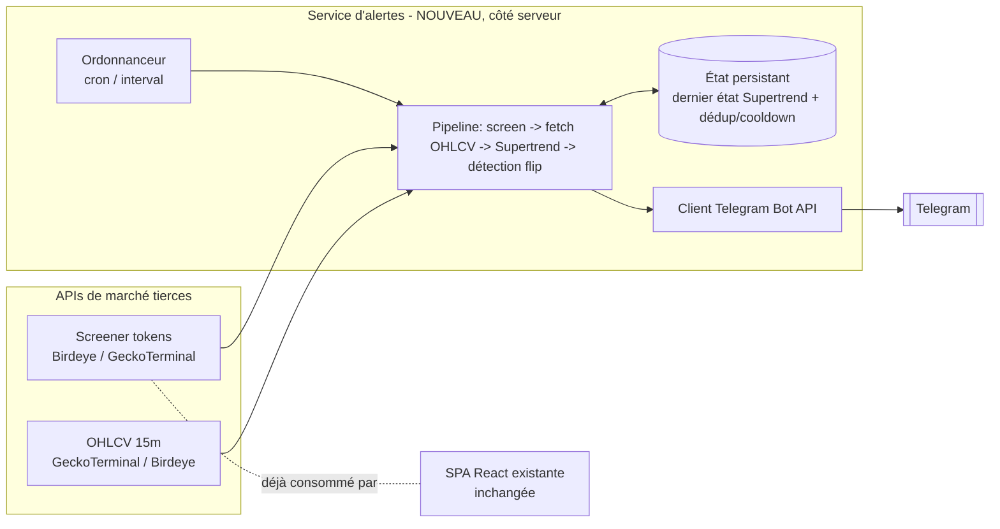

# Spécification technique — Alertes Telegram « Supertrend Breakout »

> Complément technique de `SPECIFICATION-FONCTIONNELLE.md`. Aucune implémentation ici : décisions
> d'architecture, contrats de données, algorithme, gestion des secrets et des erreurs.
> Version 1 — 2026-07-16.

---

## 1. Point de départ : ce que l'archi actuelle NE permet pas

L'app est une SPA React 19 + Vite **100 % client** :
- toute la logique de fetch vit dans les composants de page (`src/pages/*.tsx`) ;
- les secrets sont des variables `VITE_*` **embarquées dans le bundle** → publiques ;
- pas de backend, pas de base de données, pas de tâche planifiée, pas d'état persistant partagé.

Un bot Telegram impose **un secret serveur** (token du bot) et une **exécution planifiée
persistante** (scan toutes les X minutes + mémoire de l'état précédent pour détecter les flips).
Ces deux besoins sont **incompatibles** avec le tout-client. → **On introduit un composant
serveur/serverless dédié aux alertes**, découplé de la SPA. La SPA reste inchangée (le ticket est
en pure addition ; aucun fichier `src/` existant n'est modifié par cette spec).

---

## 2. Vue d'ensemble de l'architecture



Le service d'alertes est **indépendant** de la SPA : même dépôt possible (mono-repo, dossier
`alerter/` ou `server/`), mais déploiement et cycle de vie distincts.

---

## 3. Hébergement — décision actée (D1) : serverless gratuit

Enzo a tranché : **100 % gratuit/serverless**, pas de petit serveur payant persistant. L'option C
(VPS/Node persistant) est donc **écartée**.

| Option | Description | Persistance état | Coût | Adapté si |
|--------|-------------|------------------|------|-----------|
| **A. Cron serverless** (GitHub Actions schedule, Vercel Cron) | Une fonction déclenchée toutes les N min ; pas de process long | Stockage externe requis (KV, D1, Gist, fichier commité, Upstash Redis) | Gratuit → ~0 | Zéro serveur à gérer, budget nul, tolère un cron ~5 min |
| **B. Worker Cloudflare + KV** ✅ **retenu** | Worker planifié (Cron Trigger) + KV pour l'état | KV intégré, pas de dépendance externe | Gratuit (free tier généreux) | Serverless + état intégré + cron plus fin que GitHub Actions |
| ~~C. Petit service Node persistant~~ | ~~VPS, Fly.io, Railway, Render~~ | — | ~~~5 $/mois~~ | **Écarté (D1)** — budget nul demandé |

**Décision** : **Option B — Cloudflare Worker + Cron Trigger + KV**. Justification : reste gratuit
(free tier Workers/KV largement suffisant pour ce volume), l'état (`TokenTrendState`,
`AlertRecord`) est stocké nativement en KV sans dépendance externe (pas de Gist/Redis tiers à
gérer), et le Cron Trigger Cloudflare supporte une granularité plus fine (jusqu'à 1 min) que le
cron GitHub Actions (~5 min mini, non garanti à la minute) — ce qui limite le risque R3 (latence
O2). L'option A (GitHub Actions) reste une alternative de repli documentée si Cloudflare s'avère
inadapté (ex. limites CPU du free tier Workers atteintes par le volume OHLCV).

> Contrainte commune : le déclencheur doit tourner **au moins aussi souvent que la fermeture des
> bougies 15 min**. Un cron « toutes les 5 min » suffit pour ne jamais rater une clôture de plus de
> 5 min ; « toutes les 1-2 min » réduit la latence d'alerte (O2). Attention aux cron serverless dont
> la granularité minimale peut être ≥ 5 min (ex. Vercel Hobby, GitHub Actions ~5 min mini et non
> garanti à la minute).

---

## 4. Source OHLCV 15 min — décision actée (D2) : GeckoTerminal

Le Supertrend a besoin de bougies **15 min** (au moins `ATR period + warm-up` bougies fermées par
token). Comparatif des sources **déjà connues du projet** :

| Source | Endpoint OHLCV | Clé API | Timeframe 15 min | Coût | Rate limit indicatif | Remarque |
|--------|----------------|---------|------------------|------|----------------------|----------|
| **GeckoTerminal** | `GET /api/v2/networks/solana/pools/{pool}/ohlcv/minute?aggregate=15&limit=N&currency=usd` | Non | Oui (`minute` + `aggregate=15`) | Gratuit | ~30 req/min (free) | OHLCV **par pool**, pas par token → il faut mapper token → pool principal |
| **Birdeye** | `GET /defi/v3/ohlcv?address={mint}&type=15m&...` (header `X-API-KEY`, `x-chain: solana`) | **Oui** | Oui (`type=15m`) | Compute units (plan payant) | selon plan | OHLCV **par mint** (plus direct) ; clé déjà présente (`VITE_BIRDEYE_API_KEY`) mais à re-sourcer côté serveur |
| **Solana Tracker** | endpoint chart/candles (`/chart/{token}` avec `type`/interval) | **Oui** | À confirmer (support 15m) | Selon plan | selon plan | Clé requise, mapping champs à valider (déjà noté « non testé » dans le code) |
| **DexScreener** | ❌ pas d'OHLCV | — | — | — | — | Ne convient pas pour les bougies |

**Décision** : **GeckoTerminal** pour le MVP (gratuit, sans clé, déjà utilisé dans l'app, endpoint
OHLCV public), avec **Birdeye documenté en fallback/upgrade** (par mint, plus direct, mais
consomme des compute units payants) si le rate-limit GeckoTerminal (~30 req/min) s'avère
bloquant en usage réel. Ce rate-limit impose de **borner l'univers** (RG-11 = 100 tokens) et/ou
d'**étaler** les requêtes OHLCV sur le cycle (cf. §10).

### Contrainte « token → pool » (GeckoTerminal)
L'OHLCV GeckoTerminal est **par pool**, pas par token. Le screener renvoie un token (mint) ; il faut
sélectionner **le pool le plus liquide** de ce token pour requêter ses bougies. Deux approches :
- utiliser directement l'`address` de pool déjà renvoyée par la page GeckoTerminal existante ; ou
- appeler `GET /networks/solana/tokens/{mint}/pools` et prendre le pool de plus fort volume.
Avec Birdeye, l'OHLCV est **par mint**, ce qui évite ce mapping.

### Détail de réponse OHLCV GeckoTerminal (contrat attendu)
```jsonc
// GET .../ohlcv/minute?aggregate=15&limit=200&currency=usd
{
  "data": {
    "attributes": {
      // chaque élément : [timestamp_unix_s, open, high, low, close, volume]
      "ohlcv_list": [
        [1752670800, 0.00031, 0.00033, 0.00030, 0.00032, 12840.5]
        // ... triées ; vérifier l'ordre (souvent le plus récent en tête) et normaliser
      ]
    }
  }
}
```
> Le pipeline doit **normaliser** (ordre chronologique croissant), **exclure la bougie en cours**
> (non fermée) et ne calculer le Supertrend que sur les bougies fermées (RG-08).

---

## 5. Composants / modules à créer

| Module | Responsabilité |
|--------|----------------|
| `scheduler` | Déclenche un cycle à intervalle régulier (cron trigger / `setInterval`) |
| `config` | Charge et **valide** la configuration (seuils, params Supertrend, secrets) ; refuse de démarrer si incohérente (US-04) |
| `screener` | Construit l'univers de candidats (volume5m ≥ seuil ET mcap ∈ bornes) à partir de Birdeye/GeckoTerminal ; réutilise la logique des pages existantes |
| `ohlcvClient` | Récupère et normalise les bougies 15 min d'un token/pool (source choisie), gère pagination/limit et rate-limit |
| `supertrend` | Calcule l'indicateur Supertrend et l'état de tendance par bougie (fonction pure, testable) |
| `flipDetector` | Compare l'état courant à l'état persistant précédent → produit des événements de flip |
| `stateStore` | Lit/écrit l'état persistant (dernier état Supertrend par token + horodatage dernière alerte) |
| `telegramNotifier` | Formate et envoie le message via Telegram Bot API, avec retry (RG-09) |
| `apiFailure` | Réutiliser/porter `src/lib/apiError.ts` (déjà un module pur, réutilisable côté serveur) pour qualifier les échecs |
| `logger` | Logs structurés par cycle (observabilité) |

> `src/lib/apiError.ts` est déjà **framework-agnostique** (pas de dépendance React) → il peut être
> partagé tel quel entre la SPA et le service d'alertes.

---

## 6. Modèle de données (état persistant)

Minimal, orienté dédup + détection de flip. Clé = `mint` (ou `pool` selon source).

### Entité `TokenTrendState`
| Champ | Type | Description |
|-------|------|-------------|
| `mint` | string (PK) | Adresse du token Solana |
| `pool` | string \| null | Pool utilisé pour l'OHLCV (si source par pool) |
| `lastTrend` | `"haussier" \| "baissier"` | Dernier état Supertrend calculé sur bougie fermée |
| `lastClosedCandleTs` | number (unix s) | Horodatage de la dernière bougie fermée évaluée (idempotence : ne pas re-traiter la même bougie) |
| `paramsHash` | string | Hash des params Supertrend (period/multiplier/timeframe) ; si changé → run d'amorçage |
| `updatedAt` | number (unix s) | Dernière mise à jour |

### Entité `AlertRecord` (pour cooldown / dédup)
| Champ | Type | Description |
|-------|------|-------------|
| `mint` | string | Token alerté |
| `direction` | `"haussier" \| "baissier"` | Sens du flip alerté |
| `candleTs` | number | Bougie déclenchante (clé d'idempotence de l'alerte) |
| `sentAt` | number (unix s) | Horodatage d'envoi (base du cooldown RG-07) |

> **Idempotence d'alerte** : la clé logique `(mint, direction, candleTs)` garantit qu'un même flip
> (même bougie) ne produit jamais deux alertes, même après redémarrage entre calcul et envoi.

### Stockage physique (selon option d'hébergement)
- Option A (GitHub Actions) : fichier JSON commité, Gist, ou Upstash Redis (gratuit).
- Option B (Cloudflare) : **KV** (clé `mint` → JSON `TokenTrendState`) ou **D1** (SQLite).
- Option C (Node) : SQLite (fichier) ou Redis.
Volume attendu : ≤ quelques centaines de tokens → trivial quel que soit le store.

---

## 7. Contrats d'interface

### 7.1 Sortie : Telegram Bot API
- `POST https://api.telegram.org/bot<TOKEN>/sendMessage`
- Body : `{ chat_id, text, parse_mode: "HTML" | "MarkdownV2", disable_web_page_preview: true }`
- Le `<TOKEN>` et le `chat_id` sont des **secrets de config serveur** (cf. §9).
- Codes de retour à gérer : `200` OK ; `429` (Too Many Requests → respecter `retry_after` du body) ;
  `400` (mauvais formatage Markdown → fallback texte brut) ; `401/403` (token invalide → alerte
  admin/log critique).
- Limites Telegram : ~30 messages/s global, ~1 msg/s vers un même chat → throttling nécessaire si
  rafale (US-07 / Q5).

### 7.2 Entrées : APIs de marché
- **Screener** : réutiliser les URLs des pages existantes.
  - Birdeye : `GET /defi/v3/token/list?sort_by=volume_5m_usd&min_volume_5m_usd={vol}&max_market_cap={max}...`
    (déjà dans `FilterPage.tsx`) — **mais** ce endpoint n'a pas de `min_market_cap` : filtrer le
    plancher 300 k$ **côté service**.
  - GeckoTerminal : `GET /api/v2/networks/solana/pools?sort=h24_volume_usd_desc` puis filtre
    volume5m + mcap **côté service** (comme la page actuelle).
- **OHLCV** : cf. §4.
- Toutes les réponses en échec passent par `readApiFailure` / `formatApiFailure` (`apiError.ts`).

---

## 8. Algorithme du Supertrend (référence normative)

> Fonction **pure** `supertrend(candles, period, multiplier) -> Array<{ ts, trend, line }>`.
> Aucune I/O. Testable unitairement avec des jeux de bougies connus.

Étapes, pour des bougies fermées triées chronologiquement :

1. **True Range (TR)** pour chaque bougie i :
   `TR = max( high-low , |high - close_{i-1}| , |low - close_{i-1}| )`.
2. **ATR** = moyenne lissée du TR sur `period` (Wilder / RMA recommandé, cohérent avec TradingView).
   Nécessite un **warm-up** d'au moins `period` bougies avant d'avoir un ATR valide (RG-12).
3. **Bandes de base** :
   `hl2 = (high + low) / 2`
   `upperBand = hl2 + multiplier * ATR`
   `lowerBand = hl2 - multiplier * ATR`
4. **Bandes finales** (avec règle de « verrouillage » standard) :
   `finalUpper_i = (upperBand_i < finalUpper_{i-1} || close_{i-1} > finalUpper_{i-1}) ? upperBand_i : finalUpper_{i-1}`
   `finalLower_i = (lowerBand_i > finalLower_{i-1} || close_{i-1} < finalLower_{i-1}) ? lowerBand_i : finalLower_{i-1}`
5. **Supertrend / état** :
   - si `close_i > finalUpper_{i-1}` → tendance **haussière** ;
   - si `close_i < finalLower_{i-1}` → tendance **baissière** ;
   - sinon → **conserver** l'état précédent.
6. **Flip** = bougie i où `trend_i != trend_{i-1}`.

> **Définition retenue de « cassé » (D4, confirmé par Enzo)** : un flip = **changement d'état de
> tendance du Supertrend sur bougie fermée**. C'est cette transition, et non un simple croisement
> de prix intra-bougie, qui déclenche l'alerte.

> **Filtre de direction (D5, confirmé par Enzo)** : seul le flip `baissier → haussier` (le prix
> qui repasse au-dessus de la ligne Supertrend) est notifié. Un flip `haussier → baissier` est
> détecté par `flipDetector` (utile pour retrouver l'état courant du token) mais **ne produit
> jamais d'alerte** — filtré avant `telegramNotifier`. Ce n'est pas un paramètre `SENS_FLIP`
> configurable au MVP, c'est une règle figée (RG-06).

Détection de flip pour l'alerte : on ne s'intéresse **qu'au flip de la dernière bougie fermée**
`N` par rapport à `N-1`. On compare aussi à l'état persistant `lastTrend` pour couvrir le cas où
plusieurs bougies se sont fermées entre deux scans (rattrapage : ré-évaluer toutes les bougies
fermées non encore traitées depuis `lastClosedCandleTs`, alerter au plus une fois si un flip
haussier qualifiant est trouvé dans le rattrapage).

---

## 9. Sécurité & gestion des secrets

- **Secrets serveur uniquement** (jamais `VITE_`-préfixés, jamais dans le bundle client) :
  - `TELEGRAM_BOT_TOKEN`
  - `TELEGRAM_CHAT_ID`
  - `BIRDEYE_API_KEY` (si Birdeye retenu pour screener/OHLCV — **re-source côté serveur**, ne pas
    réutiliser la variable `VITE_` publique)
  - `SOLANATRACKER_API_KEY` (si retenu)
- Stockage : secrets de la plateforme (GitHub Actions Secrets, Cloudflare Worker Secrets, variables
  d'env du VPS). **Jamais commités.** Ajouter un `.env.example` documentant les noms (sans valeurs).
- Surface d'attaque : le service **n'expose aucun endpoint entrant** au MVP (il *appelle* Telegram
  et les API, il n'écoute pas). Pas de webhook Telegram entrant → pas de surface HTTP à sécuriser.
  (Si un jour on passe en mode webhook Telegram, prévoir un secret de vérification.)
- Le `chat_id` est traité comme une donnée sensible de routage (cf. NFR RGPD).

---

## 10. Stratégie de polling & rate-limit

- **Cycle** cadencé par le scheduler (§3). Chaque cycle :
  1. 1 à K requêtes screener (bornées).
  2. Jusqu'à `N ≤ RG-11` requêtes OHLCV (une par candidat) → **c'est le poste le plus coûteux**.
- **Maîtrise du rate-limit OHLCV** (GeckoTerminal ~30 req/min) :
  - borner l'univers (RG-11 = 100) ;
  - **étaler** les requêtes OHLCV (throttle/queue) pour rester sous le plafond, quitte à ce qu'un
    cycle dure plusieurs minutes (acceptable puisque la bougie 15 min ne change que tous les ¼ h) ;
  - **cache court** : ne re-fetcher l'OHLCV d'un token que si une nouvelle bougie a pu se fermer
    depuis `lastClosedCandleTs` (inutile de re-tirer les bougies 15 min plus d'une fois par ¼ h) ;
  - prioriser : screener fréquent (léger) + OHLCV seulement pour les candidats.
- **Backoff** sur 429/5xx : réutiliser la classification `apiError.ts` ; en cas de quota/rate-limit,
  sauter le token pour le cycle et réessayer au suivant (US-05).
- Ne jamais bloquer tout le cycle sur un seul token défaillant (isolation par token, `Promise.allSettled`).

---

## 11. Impacts sur l'existant, risques & dette

- **Impact SPA** : nul (le service est additif). Optionnel post-MVP : une page « Alertes » dans la
  SPA affichant l'historique — hors périmètre.
- **Réutilisation** : `apiError.ts` partagé ; logique de filtrage volume/mcap portée depuis les
  pages. Risque de **duplication** des seuils entre SPA et service → centraliser dans une config
  partagée si mono-repo.
- **Risque R1 (rate-limit OHLCV)** : le poste le plus fragile ; mitigé par cache + throttle + borne
  d'univers. Si insuffisant, basculer sur Birdeye (par mint, quota payant).
- **Risque R2 (fiabilité du signal)** : qualité/gaps des bougies GeckoTerminal sur des shitcoins peu
  liquides → faux flips. Mitigation : exiger un minimum de liquidité/volume, ignorer les bougies à
  volume nul, valider l'algo contre TradingView sur quelques cas.
- **Risque R3 (granularité cron serverless)** : certains crons gratuits ne descendent pas sous 5 min
  et ne sont pas garantis à la minute → latence O2 dégradée. Mitigation : option C (Node persistant)
  ou Cloudflare Cron (plus fin).
- **Dette potentielle** : config en env au MVP (pas d'UI) ; à industrialiser si multi-utilisateurs.

---

## 12. Tests

> Le projet n'a **aucun runner de test** aujourd'hui. En introduire un pour le service (ex. Vitest,
> cohérent avec Vite) est recommandé — le cœur algorithmique le justifie.

| Niveau | Cible | Exemples |
|--------|-------|----------|
| **Unitaire** (prioritaire) | `supertrend()` (fonction pure) | Jeux de bougies connus → états attendus ; comparaison à des valeurs TradingView de référence ; cas warm-up insuffisant |
| Unitaire | `flipDetector` | Séquences d'états → 0/1 flip ; run d'amorçage (état vide) = aucun flip ; changement de `paramsHash` = ré-amorçage |
| Unitaire | `config` validation | mcap min > max → refus de démarrage ; valeurs par défaut appliquées |
| Unitaire | `apiError` (déjà pur) | Mapping status/body → cause |
| Intégration | `ohlcvClient` | Réponse OHLCV mockée → bougies normalisées, exclusion bougie en cours, tri chronologique |
| Intégration | dédup/cooldown via `stateStore` | Même flip 2× → 1 seule alerte ; cooldown non écoulé → pas de 2ᵉ alerte |
| E2E (léger, manuel au MVP) | pipeline complet | Bougies mockées déclenchant un flip → message Telegram envoyé vers un chat de test |

- **Critère de couverture** : viser une couverture élevée sur `supertrend` et `flipDetector` (cœur
  métier, purement déterministe). Les clients réseau peuvent rester peu couverts (mockés).
