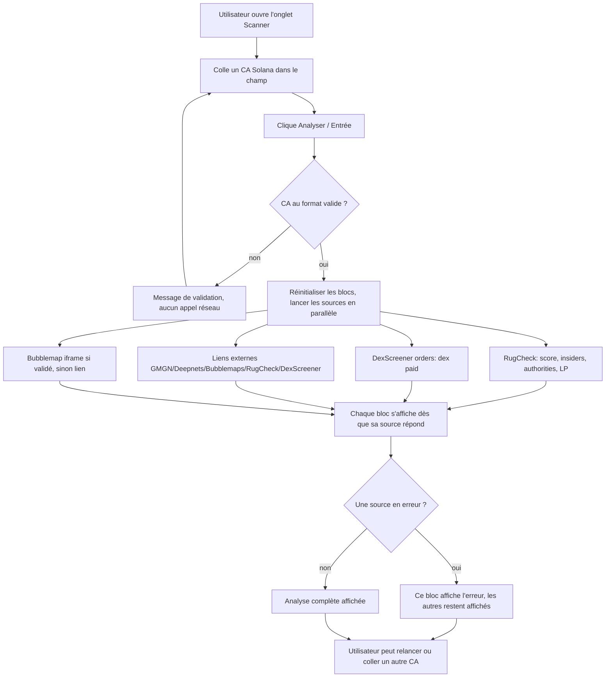

# Spécification fonctionnelle — Scanner de risque token (analyse d'un CA à la demande)

> Périmètre : nouvelle **page/onglet** dans la SPA où l'utilisateur colle **une seule contract
> address (CA) Solana** et déclenche une **analyse de risque à la demande** du token (pas de
> polling, pas de liste — un lookup, un CA à la fois).
>
> Statut : **implémenté** (`src/pages/TokenScannerPage.tsx`, route `/scanner`). Version 1 — 2026-07-19.
>
> Note de cadrage : les sources de données ont été choisies pour rester **gratuites et sans clé
> API** autant que possible. Cette contrainte structure fortement le périmètre : certaines
> informations demandées n'ont **pas** de source gratuite confirmée et sont traitées comme des
> limitations explicites (cf. §5, §9, §11), pas comme des fonctions inventées.

---

## 1. Contexte & problème

### Le besoin
Les pages existantes (`/filter`, `/gecko`, `/dexscreener`, `/solanatracker`, `/pools`) sont des
**listes de découverte** : elles présentent des tokens/pools filtrés par volume, market cap ou
fraîcheur, en polling automatique. Aucune ne répond à la question inverse : « j'ai **déjà** une
adresse de token précise sous les yeux (repérée sur Telegram, DexScreener, une pool Meteora…) —
est-elle risquée, dois-je m'en méfier ? »

Aujourd'hui, pour répondre à ça, l'utilisateur (Enzo) doit ouvrir manuellement plusieurs sites
tiers (RugCheck, DexScreener, un explorateur de bulles de holders, GMGN, deepnets…), coller la
même adresse dans chacun et recouper à la main. C'est lent et dispersé.

### Ce que la page apporte
Une **page d'inspection ciblée** : un champ, on colle un CA, on lance, et on obtient sur un seul
écran un **verdict de risque agrégé** plus les indicateurs clés d'un pré-check de sécurité de
token, en réutilisant des API publiques **sans coût** — complétés par des **liens externes** vers
les outils qui n'exposent pas de données gratuitement.

### Pourquoi maintenant
Le projet fait déjà des `fetch` client-side directs vers des API crypto tierces (Birdeye,
GeckoTerminal, DexScreener, Meteora) et une recherche de faisabilité a confirmé qu'au moins deux
sources gratuites sans clé (**RugCheck** et **DexScreener orders**) couvrent l'essentiel du besoin.
Le coût marginal d'ajouter une page d'inspection est donc faible et la valeur immédiate.

### Contrainte structurante
Contrairement au projet `alerter/`, **aucun secret serveur n'est requis** : les sources retenues
au MVP sont publiques et sans clé. La page reste **100 % cliente**, dans le modèle du projet. Le
revers : on dépend du **CORS** des API tierces depuis le navigateur (RugCheck confirmé permissif,
cf. Q1 §11 ; DexScreener déjà utilisé sans souci par `DexScreenerPage.tsx`).

---

## 2. Objectifs & résultats attendus

| # | Objectif | Résultat mesurable |
|---|----------|--------------------|
| O1 | Donner un verdict de risque en un coup d'œil | Un indicateur de risque global lisible en < 5 s après le retour des données |
| O2 | Regrouper en un écran ce qui est aujourd'hui éclaté sur plusieurs sites | ≥ 4 indicateurs (risque global, insiders, LP/authority, dex paid) affichés sans quitter la page |
| O3 | Rester gratuit | **0 €** de coût d'API au MVP (aucune clé payante requise) |
| O4 | Résilience par source | L'indisponibilité d'une source n'empêche pas l'affichage des autres (dégradation partielle, pas d'écran blanc) |
| O5 | Ne jamais tromper l'utilisateur | Toute donnée non disponible/non fiable est affichée comme **« non disponible »**, jamais devinée ou inventée |
| O6 | Accès rapide aux outils non intégrables | Liens externes (GMGN, Deepnets, Bubblemaps, RugCheck, DexScreener) ouvrant directement le token concerné |

---

## 3. Personas / utilisateurs cibles

- **Enzo (trader/scout Solana, utilisateur unique du MVP)** : repère un token ailleurs, veut un
  **pré-check de sécurité rapide** avant d'envisager d'acheter ou d'apporter de la liquidité. Il
  sait lire les indicateurs crypto (mint authority, LP burn, snipers…) mais veut gagner le temps
  du recoupement manuel.
- **(Post-MVP, éventuel)** un utilisateur moins expert qui aurait besoin de plus de pédagogie
  (tooltips, explications) — la page prévoit déjà un texte de sens métier par indicateur (§8) mais
  l'accompagnement approfondi est hors périmètre MVP.

---

## 4. Glossaire (sens métier des indicateurs pour un trader)

- **CA (Contract Address / mint)** : l'adresse Solana du token à analyser (une chaîne base58,
  typiquement 32–44 caractères). Sur Solana, le « contrat » d'un token est son **mint address**.
- **Risk score (risque global)** : note synthétique de dangerosité du token. Convention RugCheck :
  **plus le score est élevé, plus c'est risqué**. Sert de premier filtre « go / méfiance / fuis ».
- **Bubblemap** : visualisation des **clusters de holders** — qui détient quoi et quels wallets
  sont connectés entre eux. Un gros cluster concentré = risque de dump coordonné.
- **Snipers** : wallets ayant acheté dans les **tout premiers blocs** après la création. Beaucoup
  de snipers = distribution artificielle, risque de vente massive précoce.
- **Phishing** : wallets/labels connus comme **frauduleux** (arnaques, drainers). Leur présence
  parmi les holders est un signal d'alerte fort.
- **Insiders** : wallets liés au **créateur** qui ont reçu des tokens **hors achat normal**
  (transferts, pré-mine). Forte concentration insider = risque de rug/dump.
- **Burnt (LP burn / authorities)** : la liquidité est-elle **brûlée/verrouillée** et les
  **autorités mint & freeze révoquées** ? Mint authority active = le créateur peut créer des
  tokens à l'infini (dilution) ; freeze authority active = il peut geler tes tokens ; LP non
  brûlée/verrouillée = il peut retirer la liquidité (rug). Révoqué/brûlé = **rassurant**.
- **Dex paid** : le token a-t-il **payé un profil ou une pub DexScreener** (Enhanced Token Info /
  Ad) ? Indice (faible) d'un minimum d'investissement/sérieux de l'équipe — **pas** une garantie
  de sécurité, juste un signal contextuel.

---

## 5. Périmètre

### Inclus (MVP)
Analyse d'**un** CA collé manuellement, avec restitution des indicateurs suivants, **par ordre de
priorité utilisateur** et **selon la disponibilité réelle d'une source gratuite** :

| Indicateur | Source gratuite au MVP | Statut de couverture |
|------------|------------------------|----------------------|
| Risque global (score) | RugCheck `report` / `report/summary` | ✅ couvert |
| Burnt (LP burn/lock + mint/freeze authority) | RugCheck (`mintAuthority`, `freezeAuthority`, `lockers`, `totalLPProviders`, `lpLockedPct`) | ✅ couvert |
| Insiders | RugCheck (`graphInsidersDetected`, `insiderNetworks`) | ✅ couvert |
| Dex paid | DexScreener `orders/v1/solana/{ca}` | ✅ couvert (dérivé) |
| Bubblemap | Bubblemaps **iframe** publique (à valider) | ⚠️ visuel embarqué seulement, **pas** de données structurées ; à défaut → lien externe |
| Snipers | — | ⚠️ **pas de source gratuite dédiée** ; partiellement visible via `risks[]` RugCheck si présent, sinon **non couvert** → lien externe GMGN |
| Phishing | — | ⚠️ **pas de source gratuite confirmée** ; partiellement via `risks[]`/labels de wallets RugCheck si présents, sinon **non couvert** (cf. Q ouverte §11) |

Plus, systématiquement :
- Un **champ de saisie du CA** avec validation de format et bouton « Analyser » (déclenchement
  manuel, pas de polling — cf. RG-01).
- Des **liens externes** ouvrant le token dans : RugCheck, DexScreener, **GMGN** (`gmgn.ai`,
  format confirmé, cf. §11), **Deepnets** (`deepnets.ai`, format confirmé, cf. §11), **Bubblemaps**
  — chacun dans un nouvel onglet.
- Une **restitution résiliente par source** : chaque bloc affiche soit sa donnée, soit un état
  « chargement / non disponible / erreur » propre, sans casser les autres blocs.

### Exclu / repoussé (Won't, cette version)
- Analyse par lot / liste de CA — le MVP traite **un CA à la fois**.
- Polling / rafraîchissement automatique — l'analyse est **à la demande** (relançable manuellement).
- Récupération de **données structurées** de bubblemap (clusters, decentralization score) : nécessite
  l'API B2B **payante** de Bubblemaps → hors scope (au MVP, iframe ou lien seulement).
- Intégration de données GMGN / Deepnets : **pas d'API publique gratuite** → **liens externes
  uniquement** (décision utilisateur).
- Une visualisation **native** de bubblemap dans l'app (composant de graphe maison) — hors MVP
  (nécessiterait une lib de graphe et une source de données structurée, cf. spec technique).
- Historique / persistance des analyses passées, favoris, comparaison de tokens.
- Toute action on-chain (achat, snipe, apport de liquidité). **La page informe, elle n'agit jamais.**
- Support multi-chaînes : **Solana uniquement** au MVP.

---

## 6. User stories & critères d'acceptation

> Traçabilité : chaque US référence l'objectif qu'elle sert (O1-O6).

### US-01 — Analyser un token à partir de son CA *(O1, O2)*
**En tant que** trader, **je veux** coller une adresse de token Solana et lancer une analyse,
**afin d'** obtenir un pré-check de sécurité sans ouvrir cinq sites.

Critères d'acceptation :
- **Given** un CA Solana valide collé dans le champ, **when** je clique « Analyser » (ou Entrée),
  **then** la page interroge les sources et affiche les indicateurs disponibles, chacun dans son
  bloc.
- **Given** une analyse en cours, **when** les sources répondent à des vitesses différentes,
  **then** chaque bloc passe de « chargement » à « résultat » **indépendamment** (pas d'attente du
  plus lent pour tout afficher).
- **Given** une analyse terminée, **when** je colle un **autre** CA et relance, **then** les blocs
  se réinitialisent et affichent les résultats du nouveau token (aucun résidu de l'analyse
  précédente).

### US-02 — Voir un verdict de risque global immédiat *(O1)*
**En tant que** trader, **je veux** un indicateur de risque global mis en évidence en haut de page,
**afin de** décider en quelques secondes si je creuse ou si je passe.

Critères d'acceptation :
- **Given** RugCheck renvoie un `score`/`score_normalised`, **when** l'analyse aboutit, **then** un
  indicateur de risque global est affiché de façon proéminente, avec une **échelle de lecture
  claire** (rappel : plus élevé = plus risqué) et un code visuel (ex. vert/orange/rouge).
- **Given** le token est marqué `rugged: true` par RugCheck, **when** l'analyse aboutit, **then**
  un avertissement fort et non ambigu est affiché.
- **Given** RugCheck ne connaît pas le token, **when** l'analyse aboutit, **then** le bloc risque
  affiche « token inconnu de RugCheck » (cf. cas limites §9) **sans** afficher un faux score.

### US-03 — Comprendre chaque indicateur *(O1, O5)*
**En tant que** trader (même expert), **je veux** un court rappel du sens métier de chaque
indicateur, **afin de** lire correctement le résultat sans me tromper d'interprétation.

Critères d'acceptation :
- **Given** un bloc indicateur affiché, **when** je le lis, **then** une phrase de contexte
  indique ce que la valeur signifie et dans quel sens elle est bonne ou mauvaise (cf. §4/§8).
- **Given** une valeur « bonne » (ex. mint authority révoquée), **when** elle est affichée,
  **then** elle est visuellement distinguée d'une valeur « mauvaise » (couleur/badge).

### US-04 — Savoir si le token a payé DexScreener *(O2)*
**En tant que** trader, **je veux** voir un badge « Dex Paid : oui/non », **afin d'** avoir ce
signal contextuel sans ouvrir DexScreener.

Critères d'acceptation :
- **Given** l'endpoint DexScreener orders renvoie au moins un order `status: approved`, **when**
  l'analyse aboutit, **then** le badge affiche « Dex Paid : oui » (avec le/les type(s) : profil,
  ad…).
- **Given** aucun order approuvé (tableau vide, ou uniquement `processing`/`rejected`/…), **when**
  l'analyse aboutit, **then** le badge affiche « Dex Paid : non ».
- **Given** l'endpoint échoue, **when** l'erreur survient, **then** le badge affiche « non
  disponible » (pas « non »), pour ne pas confondre « pas payé » et « pas su ».

### US-05 — Accéder aux outils non intégrés en un clic *(O6)*
**En tant que** trader, **je veux** des liens qui ouvrent directement le token dans GMGN, Deepnets,
Bubblemaps, RugCheck et DexScreener, **afin d'** approfondir ce que la page n'intègre pas (snipers,
phishing, bubblemap détaillé).

Critères d'acceptation :
- **Given** un CA analysé, **when** les liens externes sont affichés, **then** chacun pointe vers
  la page du **token concerné** sur l'outil cible, s'ouvre dans un nouvel onglet (`target=_blank`,
  `rel=noreferrer`).
- **Given** une URL externe dont le format par token n'est **pas confirmé** (Deepnets — cf. §11),
  **when** elle est affichée, **then** soit elle est validée avant mise en prod, soit le lien
  renvoie vers l'outil avec une mention « format d'URL à vérifier » plutôt qu'un lien mort silencieux.

### US-06 — Résilience à l'indisponibilité d'une source *(O4, O5)*
**En tant que** trader, **je veux** que si une source tombe (RugCheck down, CORS bloqué,
DexScreener rate-limité), les autres indicateurs s'affichent quand même, **afin de** ne pas perdre
toute l'analyse pour une panne partielle.

Critères d'acceptation :
- **Given** une source en erreur (HTTP 4xx/5xx, timeout, CORS), **when** l'analyse s'exécute,
  **then** seul le bloc de cette source affiche un message d'erreur explicite (réutiliser
  `formatApiFailure`), les autres blocs affichent leurs résultats normalement.
- **Given** RugCheck indisponible, **when** l'analyse s'exécute, **then** le badge Dex Paid
  (DexScreener) et les liens externes restent fonctionnels.

### US-07 — Rejet immédiat d'un CA invalide *(O5)*
**En tant que** trader, **je veux** être averti tout de suite si l'adresse collée n'est pas une
adresse Solana plausible, **afin de** ne pas lancer une analyse vouée à l'échec.

Critères d'acceptation :
- **Given** une saisie vide ou manifestement non conforme (mauvaise longueur, caractères hors
  base58), **when** je clique « Analyser », **then** un message de validation s'affiche et **aucun
  appel réseau** n'est déclenché.
- **Given** une adresse au format plausible mais inconnue de toutes les sources, **when** l'analyse
  s'exécute, **then** chaque bloc affiche son état « inconnu / non disponible » sans erreur bloquante.

---

## 7. Parcours utilisateur (vue macro)

---

## 8. Restitution & sens métier par bloc

Chaque bloc affiche une **valeur**, un **état de lecture** (bon/neutre/mauvais quand applicable),
et une **phrase de sens métier**. Ordre d'affichage = ordre de priorité utilisateur.

| Bloc | Donnée affichée (source) | Comment la lire |
|------|--------------------------|-----------------|
| **Risque global** | `score` / `score_normalised` + `risks[]` (RugCheck) | Note synthétique, **plus haut = plus risqué**. Lister les facteurs de `risks[]` (name/level/description) s'il y en a. `rugged: true` = alerte maximale. |
| **Bubblemap** | iframe Bubblemaps ou lien (à valider) | Clusters de holders : plus c'est concentré/connecté, plus le risque de dump coordonné est élevé. |
| **Snipers** | `risks[]` si un facteur sniper est présent, sinon « non couvert → voir GMGN » | Beaucoup d'achats aux premiers blocs = distribution artificielle. Non garanti par la source gratuite (cf. §11). |
| **Phishing** | labels/`knownAccounts` RugCheck si présents, sinon « non couvert » | Présence de wallets frauduleux connus = alerte. **Aucune source dédiée gratuite confirmée** (cf. §11). |
| **Insiders** | `graphInsidersDetected` (nombre) + `insiderNetworks` (RugCheck) | Wallets liés au créateur ayant reçu hors achat. Nombre élevé / réseaux denses = risque de rug. |
| **Burnt / Authorities** | `mintAuthority`, `freezeAuthority`, `lockers`/`lockerOwners`, `totalLPProviders`, `lpLockedPct` (RugCheck) | Mint & freeze authority **null/révoquées** = bon ; LP **verrouillée/brûlée** (`lpLockedPct` élevé) = bon. Autorités actives ou LP libre = risque de dilution/gel/rug. |
| **Dex Paid** | dérivé de `orders[]` (DexScreener) | Au moins un order `approved` = « oui » (l'équipe a payé un profil/pub). Signal **contextuel faible**, pas une garantie. |
| **Liens externes** | GMGN, Deepnets, Bubblemaps, RugCheck, DexScreener | Approfondissement manuel de ce qui n'est pas intégré (snipers/phishing/bubblemap détaillé). |

Règles de restitution :
- Montants/pourcentages formatés lisiblement ; adresses tronquées à l'affichage, entières copiables.
- Un indicateur **sans source** ou **sans donnée** affiche explicitement « non disponible » ou
  « non couvert » — **jamais** une valeur par défaut trompeuse (O5).
- Codes couleur cohérents avec le reste de l'app (badges monospace inline).

---

## 9. Règles de gestion & cas limites

| ID | Règle | Comportement |
|----|-------|--------------|
| RG-01 | Analyse **à la demande** uniquement | Déclenchée par clic/Entrée ; **aucun** polling ni intervalle automatique. Relançable manuellement. |
| RG-02 | Validation du CA avant tout appel | Rejet côté client si vide / longueur hors ~[32..44] / hors alphabet base58 → message, pas d'appel réseau (US-07). |
| RG-03 | Isolation par source | Chaque source est appelée indépendamment ; son échec n'affecte que son bloc (US-06). |
| RG-04 | Pas d'invention de donnée | Toute donnée absente/non fiable → « non disponible / non couvert ». Aucune source fabriquée (O5). |
| RG-05 | Timeout par source | Un appel qui dépasse un délai raisonnable (ex. 15 s) est traité comme une erreur de ce bloc, sans bloquer les autres. |
| RG-06 | Dex Paid = « oui » seulement si un order est `approved` | `processing`/`on-hold`/`cancelled`/`rejected` ne comptent pas comme « payé/actif ». |
| RG-07 | Sens du score explicite | L'échelle (plus haut = plus risqué) est rappelée à l'écran pour éviter toute méprise. |

### Cas limites explicites
- **CA invalide (format)** : rejeté avant appel réseau, message de validation (RG-02, US-07).
- **CA valide mais inconnu de RugCheck** : RugCheck peut renvoyer une erreur (ex. 404) ou un
  rapport vide → bloc risque/insiders/authorities affiche « token inconnu de RugCheck », les
  autres blocs (Dex Paid, liens) fonctionnent quand même.
- **Token connu mais `risks: []` vide** : cas observé lors du test de faisabilité sur un token peu
  risqué → afficher « aucun facteur de risque listé » (ce **n'est pas** une erreur, c'est plutôt
  bon signe, à formuler comme tel sans sur-rassurer).
- **DexScreener orders vide** (`[]`) : « Dex Paid : non » (RG-06), différent d'« erreur ».
- **Une source en timeout / 5xx / rate-limit (429)** : message d'erreur dans ce bloc uniquement
  (via `formatApiFailure`), les autres restent affichés (RG-03, US-06).
- **CORS bloqué sur RugCheck depuis le navigateur** : traité comme une erreur de source ; l'UI
  doit rester lisible et proposer le **lien externe** RugCheck en repli (cf. risque technique).
- **Snipers / phishing sans donnée** : afficher « non couvert par la source gratuite — voir GMGN /
  outils externes » plutôt qu'un « 0 » qui laisserait croire à une absence vérifiée.
- **Bubblemaps iframe non chargeable** (bloqué par `X-Frame-Options`/CSP, ou payant) : repli
  automatique sur le **lien externe** Bubblemaps.

---

## 10. Exigences non fonctionnelles

- **Coût** : **0 €** au MVP — uniquement des endpoints publics sans clé (RugCheck, DexScreener) et
  des iframes/liens gratuits (O3).
- **Performance** : appels lancés **en parallèle** ; premier bloc affiché dès la première réponse ;
  pas d'attente bloquante du plus lent (US-01).
- **Résilience** : dégradation partielle, jamais d'écran blanc pour une panne d'une seule source
  (O4, RG-03).
- **Sécurité / vie privée** : aucun secret côté client (aucune clé requise) ; aucune donnée
  utilisateur envoyée ailleurs que le CA public collé ; liens externes en `rel="noreferrer"`.
- **i18n** : UI **en français**, cohérent avec les autres pages.
- **Accessibilité** : champ labellisé, états d'erreur textuels (pas seulement couleur), navigation
  clavier (Entrée pour lancer).
- **Cohérence** : réutiliser `apiError.ts` pour les erreurs, le style monospace inline, le pattern
  `formatAge()`/badges des autres pages, la dégradation gracieuse type `SolanaTrackerPage` (écran
  d'instruction quand un prérequis manque).

---

## 11. Hypothèses & questions ouvertes

> Ces points sont **volontairement laissés ouverts** : ils reposent sur des sources non confirmées
> par un test réel depuis le navigateur, ou sans source gratuite trouvée. Ne rien implémenter comme
> « acquis » sur ces lignes sans validation.

- **Q1 (CORS RugCheck) — RÉSOLU (2026-07-19)** : vérifié via requête `curl` avec en-tête
  `Origin: http://localhost:5173` (simule un appel navigateur) sur
  `report/summary` — la réponse inclut `Access-Control-Allow-Origin: *` et
  `Access-Control-Allow-Credentials: true`. RugCheck autorise donc les appels cross-origin
  depuis n'importe quelle origine, y compris le dev server Vite et un futur déploiement statique.
  Le repli lien externe (§ci-dessus) reste documenté pour les pannes RugCheck (timeout/5xx) mais
  n'est **plus nécessaire pour cause de CORS**. Point découvert au passage, à capturer dans la
  spec technique (§8/R6) : RugCheck renvoie aussi `X-Rate-Limit-Limit: 15` /
  `X-Rate-Limit-Remaining` (quota par fenêtre non documentée par RugCheck, décompte confirmé sur
  3 appels consécutifs) — sans risque pour un usage à la demande (1 appel/analyse), à surveiller
  seulement si une fonctionnalité de scan par lot est ajoutée plus tard.
- **Q2 (Snipers) — NON COUVERT** : aucune source gratuite dédiée « snipers » confirmée. Partiellement
  visible via `risks[]` de RugCheck **si** le token en a, mais **non garanti**. Au MVP : afficher ce
  qui remonte dans `risks[]`, sinon renvoyer vers GMGN. À rouvrir si une source gratuite est trouvée.
- **Q3 (Phishing) — NON COUVERT** : **aucune source gratuite confirmée** avec des labels de phishing
  dédiés pour Solana. Piste partielle : les `knownAccounts`/labels de wallets suspects que RugCheck
  peut exposer — **à vérifier**, format et disponibilité non confirmés. À défaut, afficher « non
  couvert ». Ne pas inventer de source.
- **Q4 (format `risks[]` RugCheck) — RÉSOLU (2026-07-19)** : vérifié en conditions réelles sur une
  soixantaine de tokens pump.fun frais/à faible liquidité (via les pools Meteora les plus récentes).
  Format d'une entrée confirmé : `{ name, value, description, score, level }` (`level` observé :
  `"warn"` / `"danger"`). Labels réellement observés : *Low Liquidity*, *Top 10 holders high
  ownership*, *Single holder ownership*, *High ownership*, *High holder concentration*, *Creator
  history of rugged tokens*. **Aucun label sniper/phishing observé** sur cet échantillon — le
  filtrage par mots-clés du bloc Snipers/Phishing (§8) reste donc un pari raisonnable mais non
  confirmé positivement ; il restera très probablement silencieux en pratique (comportement
  honnête au sens de RG-04, pas un bug). Point additionnel : le champ `value` (ex. `"$1710.90"`,
  `"80.00%"`) porte l'info chiffrée du facteur de risque et n'est aujourd'hui pas affiché par
  l'UI — amélioration à considérer en Lot 5.
- **Q5 (Bubblemaps iframe gratuite) — RÉSOLU (2026-07-19)** : vérifié en conditions réelles
  (Playwright, navigateur headless) sur `https://app.bubblemaps.io/sol/token/{address}` — l'iframe
  se charge sans clé et sans blocage `X-Frame-Options`/CSP (testé sur l'adresse USDC ; Bubblemaps
  affiche son propre message « Map not available for this token » pour les tokens qu'il ne
  supporte pas, mais l'iframe elle-même charge). Le pattern d'URL est donc confirmé bon. Le lien
  externe reste affiché en permanence à côté (pas seulement en repli), au cas où un token précis
  ne soit pas supporté par leur outil.
- **Q6 (URL Deepnets par token) — RÉSOLU (2026-07-19)** : format confirmé
  `https://deepnets.ai/token/{mint}` (route React `/token/:mint` trouvée dans le bundle JS du
  site, testée en HTTP 200 sur un mint réel). Découverte additionnelle **importante** : Deepnets
  expose une vraie API (`https://api.deepnets.ai/api/token-safety?mint={mint}`, documentée sur
  `/docs`, CORS permissif) qui renvoie exactement le type de verdict recherché
  (`overallSafetyLevel`, concentration de holders/réseau, `isMintable`/`isFreezable`,
  `criticalRisks[]`, `warnings[]`). **Mais elle est payante** : protégée par le protocole **x402**
  (micropaiement on-chain, 0.01 USDC par appel sur Solana, wallet + signature de transaction
  requis). Ça romprait la contrainte structurante du projet (§ci-dessus : « aucun secret serveur
  requis », 100 % cliente, O3 « rester gratuit »). **Décision (2026-07-19) : ne pas intégrer**,
  rester en lien externe uniquement vers `deepnets.ai/token/{mint}` — cf. R5 technique.
- **Q7 (URL GMGN) — RÉSOLU (2026-07-19)** : `https://gmgn.ai/sol/token/{address}` confirmé
  fonctionnel par test manuel de l'utilisateur. Point additionnel découvert au passage : GMGN
  bloque toute requête programmatique (page token ou API) derrière une protection anti-bot
  Cloudflare (403 dès la première requête, challenge géré) — aucune intégration de données GMGN
  n'est donc possible de toute façon ; le lien externe reste la seule option, comme déjà décidé
  (R2).
- **Q8 (verdict agrégé)** : faut-il un **score agrégé maison** combinant plusieurs signaux, ou se
  contenter d'afficher le score RugCheck comme verdict global ? Proposition MVP : **afficher le
  score RugCheck tel quel** (ne pas fabriquer une pondération non justifiée), laisser l'agrégation
  maison en évolution.
