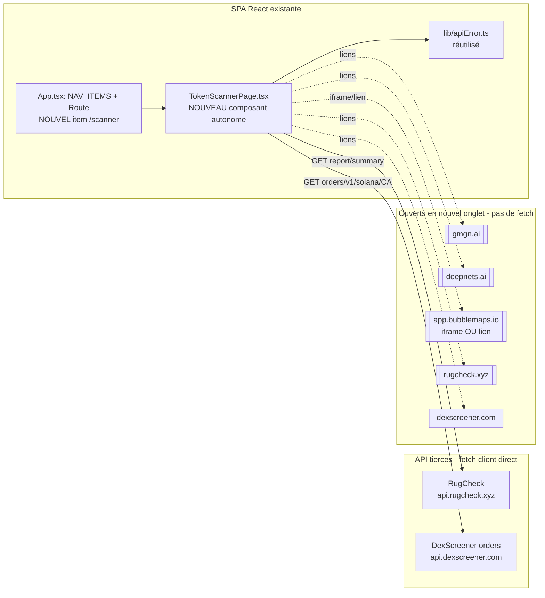

# Spécification technique — Scanner de risque token

> Complément technique de `SPECIFICATION-FONCTIONNELLE.md`. Architecture de la page, endpoints
> exacts, mapping données→UI, isolation des erreurs par source, risques techniques.
> Version 1 — 2026-07-19. Statut : **implémenté** (`src/pages/TokenScannerPage.tsx`, route `/scanner`).
>
> Principe directeur : rester dans le modèle du projet — **page React autonome, 100 % cliente,
> `fetch` directs, aucune nouvelle dépendance npm, gestion d'erreur via `apiError.ts`, isolation
> des sources** (dans l'esprit du `Promise.allSettled` de `alerter/notifier.ts`, où l'échec d'un
> canal n'empêche pas l'autre).

---

## 1. Point de départ : ce que l'archi actuelle fournit déjà

Le projet est une SPA React 19 + Vite **sans backend** : chaque page sous `src/pages/` est
autonome (son fetch, son état, ses erreurs, son rendu inline monospace), et le seul code partagé
est `src/lib/apiError.ts`. Le routing est dans `src/App.tsx` (`react-router-dom` + `NAV_ITEMS`).

La nouvelle page réutilise **tout ce socle** :
- même pattern qu'une page existante (`DexScreenerPage.tsx` est le modèle le plus proche : appels
  `fetch` sans clé, `readApiFailure`/`formatApiFailure`, tableaux inline) ;
- différence structurante : **pas de polling** (`useEffect` + `setInterval`), mais un déclenchement
  **manuel** (bouton/Entrée) — donc pas d'intervalle à nettoyer, juste un handler `async`.

Aucune donnée n'a besoin d'être partagée avec les autres pages → aucun store, aucune modif des
autres pages. Le seul fichier existant **modifié** est `src/App.tsx` (ajout route + item de nav).

---

## 2. Vue d'ensemble de l'architecture



La page est **additive** : elle ajoute un fichier `src/pages/` et deux lignes dans `src/App.tsx`.

---

## 3. Composant & structure de la page

### Fichier : `src/pages/TokenScannerPage.tsx`
Nom cohérent avec les autres (`FilterPage`, `PoolsPage`, `DexScreenerPage`…). Export par défaut du
composant.

### Route & navigation (`src/App.tsx`)
- Ajouter `{ to: "/scanner", label: "Scanner" }` à `NAV_ITEMS`.
- Ajouter `<Route path="/scanner" element={<TokenScannerPage />} />` et l'import.

### État interne (un `useState` par source, pour l'isolation)
Chaque source a son **propre triplet d'état** afin qu'un bloc puisse être en erreur pendant qu'un
autre affiche son résultat (RG-03 / US-06) :

```ts
type BlockState<T> =
  | { status: "idle" }
  | { status: "loading" }
  | { status: "ok"; data: T }
  | { status: "unknown" }              // source a répondu mais ne connaît pas le token
  | { status: "error"; message: string }; // formatApiFailure(...)
```

- `ca` : la saisie brute du champ.
- `rugcheck: BlockState<RugcheckReport>`
- `dexPaid: BlockState<DexPaidResult>`
- (Bubblemap et liens externes ne font **aucun** fetch → pas d'état de chargement, juste dérivés du
  `ca` validé.)

### Handler d'analyse (déclenchement manuel, pas de polling)
```
onAnalyze():
  1. valider le CA (RG-02) → sinon message, return (aucun fetch)
  2. remettre chaque BlockState à "loading"
  3. lancer les fetch EN PARALLÈLE, chacun isolé dans son propre try/catch
     (Promise.allSettled ou des .then/.catch séparés) — un rejet ne propage pas aux autres
  4. chaque source met à jour SON état dès sa réponse (affichage progressif)
```

Pas de `setInterval`, pas de cleanup d'intervalle. Optionnel : un `AbortController` par appel pour
annuler les fetch en vol si l'utilisateur relance avec un autre CA avant la fin (évite qu'une
réponse tardive de l'analyse N-1 écrase l'affichage de l'analyse N).

---

## 4. Sources de données — endpoints exacts & champs utiles

### 4.1 RugCheck (gratuit, sans clé) — cœur de l'analyse

Deux endpoints de lecture, **sans clé API** :

```
GET https://api.rugcheck.xyz/v1/tokens/{mint}/report
GET https://api.rugcheck.xyz/v1/tokens/{mint}/report/summary
Accept: application/json
```

- `report/summary` (allégé) : `score`, `score_normalised`, `risks[]`, `lpLockedPct`.
- `report` (complet) : en plus — `token.mintAuthority`, `token.freezeAuthority`, `topHolders`,
  `totalHolders`, `totalLPProviders`, `lockers`/`lockerOwners`, `rugged` (bool),
  `graphInsidersDetected` (nombre), `insiderNetworks` (détail), `creator`, `creatorTokens`,
  `verification.jup_verified`.

**Recommandation** : utiliser `report` (complet) pour couvrir risque + insiders + authorities + LP
en **un seul appel**. Garder `report/summary` en tête comme repli plus léger si `report` s'avère
lourd ou plus souvent en erreur.

> **Format de `risks[]` confirmé (Q4, 2026-07-19)** sur une soixantaine de tokens pump.fun
> frais/à faible liquidité : `{ name, value, description, score, level }`, `level` observé en
> `"warn"`/`"danger"`. Labels réellement vus : *Low Liquidity*, *Top 10 holders high ownership*,
> *Single holder ownership*, *High ownership*, *High holder concentration*, *Creator history of
> rugged tokens*. Aucun label sniper/phishing observé sur cet échantillon (cf. §6 pour l'impact
> sur le mapping d'affichage). Le champ `value` (valeur chiffrée du facteur, ex. `"$1710.90"`)
> n'est pas encore exploité par l'UI.

Champs → blocs UI :

| Champ RugCheck | Bloc UI | Lecture |
|----------------|---------|---------|
| `score` / `score_normalised` | Risque global | Plus haut = plus risqué (rappel à l'écran). |
| `risks[]` | Risque global (+ potentiellement Snipers/Phishing si labels présents) | Lister name/level/description si non vide. |
| `rugged` | Risque global | `true` → alerte maximale. |
| `token.mintAuthority` | Burnt/Authorities | `null` = révoquée = bon. |
| `token.freezeAuthority` | Burnt/Authorities | `null` = révoquée = bon. |
| `lockers` / `lockerOwners`, `totalLPProviders`, `lpLockedPct` | Burnt/Authorities | LP verrouillée/brûlée = bon. |
| `graphInsidersDetected`, `insiderNetworks` | Insiders | Nombre/réseaux élevés = risque. |
| `verification.jup_verified` | (contexte) Risque global | Vérifié Jupiter = signal positif faible. |

### 4.2 DexScreener orders (gratuit, sans clé) — Dex Paid

```
GET https://api.dexscreener.com/orders/v1/solana/{tokenAddress}
Accept: application/json
```

- Confirmé par test curl : renvoie un tableau `orders[]`, chaque order ayant `type`
  (`tokenProfile` | `communityTakeover` | `tokenAd` | `trendingBarAd`), `status`
  (`processing` | `cancelled` | `on-hold` | `approved` | `rejected`) et `paymentTimestamp`.
- **Dérivation Dex Paid** (RG-06) : `dexPaid = orders.some(o => o.status === "approved")`.
  Afficher aussi les `type` des orders approuvés (profil / ad).
- Rate limit connu : **60 req/min** — sans risque ici (un appel par analyse manuelle).
- Le projet appelle **déjà** `api.dexscreener.com` depuis le navigateur (`DexScreenerPage.tsx`)
  sans souci CORS → cette source est la moins risquée.

### 4.3 Bubblemaps — iframe OU lien (pas de fetch de données)

- **Confirmé (Q5, 2026-07-19)** : iframe de la visualisation publique gratuite,
  `https://app.bubblemaps.io/sol/token/{address}`, testée en navigateur réel (Playwright) — se
  charge sans clé, sans blocage `X-Frame-Options`/CSP. **Aucune donnée structurée** récupérée
  (juste le visuel embarqué) ; pour un token que Bubblemaps ne supporte pas, c'est **leur propre
  page** dans l'iframe qui affiche « Map not available », pas une erreur de chargement — implémenté
  en gardant systématiquement le lien externe visible à côté (pas seulement en repli), plutôt que
  de tenter une détection `onerror` peu fiable.
- **Hors scope** : l'API B2B payante (`X-ApiKey`) pour clusters/decentralization score.

### 4.4 Liens externes (aucun fetch) — GMGN & Deepnets

Simples `<a target="_blank" rel="noreferrer">` construits à partir du CA validé :
- **GMGN** : `https://gmgn.ai/sol/token/{address}` — **confirmé (Q7, 2026-07-19)** par test manuel.
  GMGN bloque par ailleurs toute requête programmatique derrière une protection anti-bot
  Cloudflare (403 dès la première requête) : aucune donnée structurée n'est récupérable de cette
  source, lien externe uniquement, sans alternative.
- **Deepnets** : `https://deepnets.ai/token/{address}` — **confirmé (Q6, 2026-07-19)**, route
  `/token/:mint` trouvée dans le bundle JS du site et testée en HTTP 200. Deepnets expose par
  ailleurs une vraie API (`https://api.deepnets.ai/api/token-safety?mint={mint}`, doc sur `/docs`,
  CORS permissif) renvoyant `overallSafetyLevel`, concentration de holders/réseau,
  `isMintable`/`isFreezable`, `criticalRisks[]`, `warnings[]` — exactement le signal recherché.
  Mais elle est **payante** : gated par le protocole x402 (0.01 USDC par appel sur Solana, wallet
  + transaction signée requis). **Décision produit (2026-07-19) : ne pas intégrer**, incompatible
  avec le modèle « 100 % client, aucun secret, gratuit » du projet (cf. R5). Reste en lien externe.
- **RugCheck** (`https://rugcheck.xyz/tokens/{mint}`) et **DexScreener**
  (`https://dexscreener.com/solana/{mint}`) : liens de repli/approfondissement toujours affichés,
  y compris quand le fetch correspondant a échoué (utile si CORS RugCheck bloque — cf. §8 R1).

---

## 5. Modèle de données (types côté client uniquement)

Aucune base, aucune persistance : des **interfaces TypeScript** décrivant les réponses, définies en
tête de `TokenScannerPage.tsx` (comme `DexPair`/`DexResponse` dans `DexScreenerPage.tsx`). Formes
**tolérantes** (champs optionnels) car les réponses tierces ne sont pas sous notre contrôle.

```ts
// RugCheck — sous-ensemble utile (formes optionnelles, à affiner après vérif du contrat réel)
interface RugcheckRisk { name?: string; level?: string; description?: string; score?: number; }
interface RugcheckReport {
  score?: number;
  score_normalised?: number;
  risks?: RugcheckRisk[];
  rugged?: boolean;
  lpLockedPct?: number;
  totalLPProviders?: number;
  graphInsidersDetected?: number;
  insiderNetworks?: unknown[];      // détail à typer après observation
  token?: { mintAuthority?: string | null; freezeAuthority?: string | null };
  verification?: { jup_verified?: boolean };
  // topHolders, totalHolders, lockers, creator… à ajouter selon besoin d'affichage
}

// DexScreener orders
interface DexOrder { type?: string; status?: string; paymentTimestamp?: number; }
interface DexPaidResult { paid: boolean; approvedTypes: string[]; }
```

> Ces types sont **locaux à la page** (aucun partage avec `alerter/` ni les autres pages). Si le
> contrat réel diverge après vérification (Q4), ajuster ici — la tolérance des champs optionnels
> limite le risque de crash au runtime.

---

## 6. Mapping données → UI

Rendu : blocs empilés dans l'ordre de priorité utilisateur, style inline monospace du projet
(badges, tableaux). Chaque bloc lit **son** `BlockState` :

| BlockState.status | Rendu du bloc |
|-------------------|----------------|
| `idle` | Bloc neutre / placeholder « lancez une analyse » |
| `loading` | Indicateur de chargement local au bloc |
| `ok` | Données formatées + phrase de sens métier + code couleur bon/neutre/mauvais |
| `unknown` | « token inconnu de la source » (ex. RugCheck 404) — **pas** une erreur rouge |
| `error` | `formatApiFailure(...)` — message rouge local, les autres blocs restent affichés |

Règles :
- **Snipers / Phishing** : n'ont pas de source dédiée → afficher « non couvert par la source
  gratuite » + renvoi GMGN, **sauf** si un facteur correspondant est présent dans `risks[]` (à
  déterminer après Q4). Ne **jamais** afficher « 0 sniper » comme un fait vérifié (RG-04).
- **Bon/mauvais explicite** : mint/freeze authority `null` → badge vert « révoquée » ; non-null →
  badge rouge « active ». `lpLockedPct` élevé → vert. `rugged: true` → bandeau rouge.
- **Dex Paid** : `paid=true` → badge « Dex Paid : oui » (+ types) ; `paid=false` → « non » ;
  `error` → « non disponible » (ne pas confondre non-payé et non-su, US-04).

---

## 7. Gestion d'erreurs par source (isolation)

Reprend le principe d'**isolation** de `alerter/notifier.ts` (un canal en panne n'empêche pas
l'autre), transposé aux sources de la page :

- Chaque source est appelée dans **son propre** `try/catch` (ou branche `Promise.allSettled`).
- Sur `res.ok === false` → `readApiFailure("RugCheck" | "DexScreener", res)` puis `formatApiFailure`
  pour le message (réutilisation directe de `src/lib/apiError.ts`).
- Sur exception réseau (dont **CORS** et **timeout** via `AbortController`) → `BlockState.error`
  avec un message clair (« source injoignable / bloquée (CORS) / délai dépassé »).
- Un `status: "error"` ou `"unknown"` d'une source **ne modifie jamais** l'état des autres blocs.
- Distinguer **404 RugCheck** (token inconnu → `"unknown"`) d'une vraie panne (`"error"`) : un
  token inconnu n'est pas une erreur d'infrastructure.

---

## 8. Sécurité, dépendances & risques techniques

### Sécurité
- **Aucun secret** : toutes les sources MVP sont publiques sans clé → rien à mettre dans `.env`,
  rien à protéger, pas de rupture du modèle « tout client » (contrairement à `alerter/`).
- Seule donnée « sortante » : le **CA public** collé, envoyé aux API tierces — pas de donnée
  personnelle.
- Liens externes et iframe en `rel="noreferrer"` / sandbox iframe raisonnable ; l'iframe
  Bubblemaps est du contenu tiers → l'isoler (attribut `sandbox` si le rendu le permet).

### Dépendances
- **Aucune nouvelle dépendance npm.** Le projet n'a que `react`/`react-dom`/`react-router-dom` en
  runtime ; la page n'utilise que `fetch` + `useState`/`useCallback`.
- Une **lib de graphe** (pour dessiner nativement le bubblemap) serait nécessaire **uniquement**
  pour une visualisation maison des clusters — **hors MVP** (on fait iframe/lien). À réévaluer
  seulement si l'API Bubblemaps payante est un jour adoptée (données structurées à dessiner).

### Risques techniques

| ID | Risque | Prob. | Impact | Mitigation |
|----|--------|-------|--------|------------|
| R1 | ~~CORS RugCheck non testé~~ — **RÉSOLU (2026-07-19)** : `curl` avec `Origin: http://localhost:5173` sur `report/summary` renvoie `Access-Control-Allow-Origin: *` | — | — | Aucune mitigation nécessaire ; le repli lien externe reste en place pour les pannes RugCheck (timeout/5xx), pas pour du CORS |
| R2 | **GMGN sans API exploitable** — bloqué par anti-bot Cloudflare (403 dès la 1re requête, testé 2026-07-19) ; **Deepnets a une API mais payante** (x402, cf. Q6) — dans les deux cas, liens seulement | Certaine (confirmé) | Snipers/phishing/insiders détaillés non intégrés | Décision produit : liens externes (US-05) ; ne pas promettre de données intégrées ; ne pas contourner la protection anti-bot GMGN, ne pas intégrer de paiement x402 pour Deepnets |
| R3 | ~~Iframe Bubblemaps peut-être bloquée~~ — **RÉSOLU (2026-07-19)** : testée en navigateur réel, charge sans blocage | — | — | Aucune ; lien externe gardé visible en permanence par choix de design, pas par nécessité |
| R4 | ~~Format `risks[]` RugCheck inconnu~~ — **RÉSOLU (2026-07-19)** : testé sur ~60 tokens réels, schéma et labels observés confirmés (cf. §4.1) | — | Mapping des facteurs textuels fiable ; détection sniper/phishing par mots-clés reste un pari non confirmé positivement (aucun label de ce type observé) | Types tolérants (§5) conservés par prudence ; réévaluer les mots-clés si un label sniper/phishing est un jour observé |
| R5 | ~~URL Deepnets/GMGN par token non confirmées~~ — **RÉSOLU (2026-07-19)** : `gmgn.ai/sol/token/{address}` et `deepnets.ai/token/{address}` confirmés tous les deux | — | — | Aucune ; liens mis à jour dans `TokenScannerPage.tsx` |
| R6 | **Rate limit / indisponibilité tierce** — RugCheck expose `X-Rate-Limit-Limit: 15` / `X-Rate-Limit-Remaining` (fenêtre non documentée par RugCheck, décompte confirmé sur 3 appels consécutifs), DexScreener 60/min | Faible | Analyse ponctuellement en erreur | Un appel par analyse manuelle (pas de polling) → charge minime face aux deux quotas ; `apiError.ts` gère 429/5xx ; relance manuelle. À réévaluer seulement si un scan par lot est ajouté plus tard |
| R7 | **Réponse tardive d'une analyse précédente écrase la nouvelle** | Faible | Affichage incohérent | `AbortController` par appel, annulé au relancement (§3) |

---

## 9. Impacts sur l'existant

- **`src/App.tsx`** : +1 import, +1 `NAV_ITEMS`, +1 `<Route>` (seul fichier existant modifié).
- **`src/lib/apiError.ts`** : **réutilisé tel quel**, aucune modif.
- Autres pages, `alerter/`, build : **aucun impact** (page autonome, aucune dépendance partagée,
  pas de nouvelle variable d'env, `npm run build` inchangé hormis le nouveau fichier type-checké).
- Pas de nouvelle entrée `.env` / `.env.example` (aucune clé).

---

## 10. Tests

> Pas de runner de test dans le projet (cf. CLAUDE.md) → même approche que le reste : **validation
> manuelle** + relecture, sur des CA réels choisis pour couvrir les cas.

| Niveau | Cible | Vérification |
|--------|-------|--------------|
| Manuel | Validation CA (RG-02) | CA vide / trop court / caractères hors base58 → message, **aucun** appel réseau (onglet Réseau vide) |
| Manuel | Isolation des sources (US-06) | Simuler une source down (URL RugCheck cassée) → son bloc en erreur, Dex Paid + liens OK |
| Manuel | RugCheck token connu **risqué** | Observer `risks[]` non vide → valider le mapping et le format réel (Q4) |
| Manuel | RugCheck token **inconnu** | 404/rapport vide → bloc « inconnu », pas « erreur » |
| Manuel | RugCheck token « propre » | `risks: []`, authorities nulles → badges verts, sens correct |
| Manuel | Dex Paid oui / non | Un token avec order `approved` → « oui » ; sans → « non » ; endpoint cassé → « non disponible » |
| ~~Manuel~~ Fait | ~~CORS RugCheck~~ (R1) | **Résolu par test curl le 2026-07-19** (`Origin` header → `Access-Control-Allow-Origin: *`) ; re-vérifier en dev réel au Lot 1 par acquit de conscience, sans bloquer dessus |
| ~~Manuel~~ Fait | ~~Iframe Bubblemaps~~ (R3) | **Résolu (2026-07-19)**, testé en navigateur réel |
| Manuel | Liens externes | GMGN/Deepnets/Bubblemaps/RugCheck/DexScreener ouvrent bien la page **du token** (valider Q6/Q7) |
| Build | Type-check | `npm run build` passe (nouveau fichier compilé sans erreur TS) |
